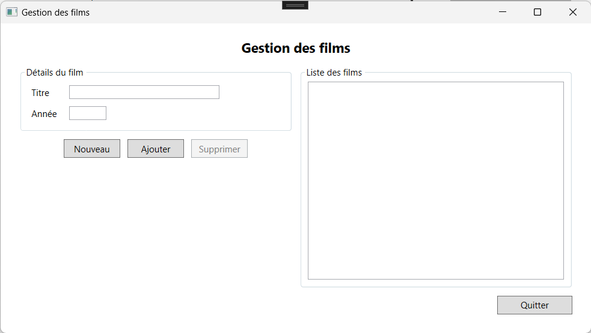

# Exercices bloc 2

## Semaine 7
::: details Liste génériques

### Liste génériques

Mettre en pratique la création d'interfaces en WPF et l'utilisation de la liste générique.

#### Problème

1)	Créer un nouveau projet WPF nommé **S7E1_ExerciceListeGenerique**.
2)	Créer la classe **Film** répondant aux spécifications suivantes :
    - **Attributs et propriétés** :
        - Id (Identifiant unique)
        - Titre (Ne doit pas être vide)
        - Année (Doit être supérieur à 1888 et inférieure ou égale à l'année courante)
    - **Constructeur**
        - Avec paramètre permettant d'initialiser l'id, le titre et l'année du film.
    - **Méthodes** :
        - ToString() : Retourne le titre du film avec l'année entre parenthèses. 
3)	Créer une classe nommée GestionFilms permettant la gestion d’une liste de film.
    - **Attributs et propriétés** :
        - Liste de films (set privé).
    - **Constructeur**
        - Sans paramètre permettant d’initialiser une liste de films vide.	
    - **Méthodes**
        - **bool AjouterFilm(Film pFilm)** : Permet l’ajout du film à la liste de film. Un film ne peut pas être ajouté s’il existe déjà un film ayant le même titre et la même année dans la liste. Retourne vraie si le film a été ajouté, faux sinon.
        - **bool SupprimerFilm(Film pFilm)** : Permet la suppression du film de la liste de films. Retourne vraie si le film a été trouvé et supprimé, faux sinon.

4)	Créer l'interface suivante
 

- Ajouter un attribut de type GestionFilm nommé **_gestionFilms** dans votre formulaire. Celui-ci vous permettra de gérer les films.
- Écrire le code du formulaire permettant :
    - D'initialiser le formulaire en cliquant sur le bouton Nouveau. L'initialisation doit supprimer le contenu des champs, désactiver le bouton supprimer et activer le bouton ajouter.
    - De valider le formulaire. Tous les champs sont obligatoires. L'année doit être inférieure à la date du jour. Vous pouvez utiliser DateTime.Now.Year pour obtenir l'année courante. Vous devez afficher toutes les erreurs à l'utilisateur si le formulaire n'est pas valide. 
    - D'ajouter un nouveau film valide à la liste des films contenus dans votre attribut **_gestionFilms**. N'oubliez pas de donner une rétroaction à l'utilisateur si l'ajout a fonctionné ou non. Vous devez mettre à jour le ListBox.
    - D'afficher la listes des films contenus dans l'attribut **_gestionFilms**
    - De sélectionner un film dans le ListeBox et d'afficher les informations d'un film dans les champs texte. Lors d'une sélection, le bouton ajouter est désactivé et le bouton supprimé est activé.
    - De supprimer un film sélectionné dans la liste de la liste des films contenue dans l'attribut **_gestionFilm**. Vous devez demander à l'utilisateur de confirmer la suppression avant d'effectuer l'action. N'oubliez pas d<!---->e donner une rétroaction à l'utilisateur si la suppression a fonctionné ou non. Vous devez mettre à jour le ListBox.
    - Permettre de fermer le formulaire avec le bouton quitter.

#### Solution

Télécharger la solution commplète : [S7E1-ListeGeneriqe-Solution](https://gitlab.com/420-14b-fx/contenu/-/raw/main/bloc2/cours%2013/S7E1-ListeGenerique%20-%20Solution.zip?ref_type=heads)

:::

::: details Formulaire secondaire

### Formulaire secondaire

### Objectif 
Mettre en pratique la création d'interfaces en WPF avec plusieurs formulaires et l'utilisation de la liste générique.

### Problème 

1)	Créer un nouveau projet WPF nommé S7E2_Formulaire secondaire.
2)	Créer la classe Film (vous pouvez réutiliser la classe de l'exercice précédent) répondant aux spécifications suivantes :
    - **Attributs et propriétés** :
        - Titre : Ne peut pas être vide. Si tel est la cas, alors la valeur est "Non fourni".
        - Année : Doit être entre 1888 et l'année courante. Si est invérieur à 1888 alors la valeur est 1888 et si est supérieur à l'année courante alors la valeur est l'année courante.
        - Acteurs (liste de chaîne de caractères)
    - **Constructeur**
        - Avec paramètre permettant d'initialiser le titre et l'année du film ainsi qu'une liste d'acteur vide.
    - **Méthodes** :
        - ToString() : Retourne le titre du film avec l'année entre parenthèses. 

3) Créer une classe nommée GestionFilms permettant la gestion d’une liste de film. (Vous pouvez réutiliser celle créer dans l'exercice précédent)

    - **Attributs et propriétés** :
        - Liste de films (set privé).
    - **Constructeur**
        - Sans paramètre permettant d’initialiser une liste de films vide.
    - **Méthodes**
        - bool AjouterFilm(Film pFilm) : Permet l’ajout du film à la liste de film. Un film ne peut pas être ajouté s’il existe déjà un film ayant le même titre et la même année dans la liste. Retourne vraie si le film a été ajouté, faux sinon.
        - bool SupprimerFilm(Film pFilm) : Permet la suppression du film de la liste de films. Retourne vraie si le film a été trouvé et supprimé, faux sinon.
4)	Créer l'interface suivante dans le formulaire principal.

- Ajouter un attribut de type GestionFilms dans votre formulaire et l’instancier dans la méthode « Window_Loaded » du formulaire. Celui-ci vous permettra de gérer les films.
- Écrire le code du formulaire permettant :
    - Lors du chargement du formulaire. Ajouter le film suivant à votre attribut de type GestionFilms ainsi qu'un film de votre choix :
        - Titre: Spider-man No way hom
        - Année: 2021
        - Acteurs: Tome Holland, Zendaya Colman  
    - Afficher la liste de film dans le ListBox.

5) Ajouter et créer l'interface d'un nouveau formulaire nommé **FormFilm** à votre projet:

- Écrire le code du formulaire permettant :
    - D'afficher les détails du film sélectionné dans le formulaire parent.
    - Fermer le formulaire lors du clique du bouton Fermer.

6) Écrire le code du bouton « Afficher détails » du formulaire principal permettant d'afficher les détails d'un film sélectionné dans le formulaire FormFilm.

#### Solution

Télécharger la solution commplète : [S7E2-FormulaireSecondaire-Solution](https://gitlab.com/420-14b-fx/contenu/-/raw/main/bloc2/cours%2014/S7E2-FormulaireSecondaire.zip?ref_type=heads)

:::

## Semaine 8
::: details S8E1 - Application Windows multiformulaires

### Objectif 
Mettre en pratique la construction d'une application Windows multiformulaires permettant d'effectuer les opérations classiques sur des données, soient créer/ajouter (**C**reate), lire/consulter (**R**ead), mettre à jour/modifier (**U**pdate), supprimer/détruire (**D**elete).  On utilise souvent l'acronyme CRUD en anglais pour désigner cet ensemble d'opérations très courant en informatique de gestion.

### Problème

Complétez l'exemple [S8C1-DemoCRUD](https://gitlab.com/420-14b-fx/contenu/-/raw/main/bloc2/cours%2015/S8C1-DemoCRUD%20-%20Create.zip?ref_type=heads) présenté en classe en implémentant la **modification** et la **suppression** d'un employé.  
- Pour la modification, vous devez modifier le formulaire existant afin qu'il affiche les informations d'un employé sélectionné et permette la modification.  Assurez-vous de bien modifier le titre de du formulaire ainsi que le libellé des boutons.
- Pour la suppression, vous devez modifier le formulaire pour qu'il affiche les informations de l'employé en lecture seule seulement. Vous devez également demander la confirmation par l'utilisateur avant la suppression. Assurez-vous de bien modifier le titre de du formulaire ainsi que le libellé des boutons.

À la suite d'une de ces opérations, faites-en sorte que la liste des employés soit modifiée ainsi que le ListBox présentant les employés. 

:::

<!--
## Semaine 9
::: details Surcharge d'opérateurs

### Surcharge d'opérateurs

### Objectif 
Mettre en pratique la surcharge des opérateurs.e.

### Problème 
Vous devez créer une classe Matrice qui représente une matrice bidimensionnelle. Ensuite, vous devez surcharger les opérateurs + et - pour permettre l'addition et la soustraction de matrices. De plus, vous devez surcharger l'opérateur * pour permettre la multiplication d'une matrice par un nombre.

1) Créez une classe Matrice avec un attribut qui est une matrice bidimensionnelle (un tableau 2D) pour stocker les éléments de la matrice ainsi que deux propriétés en lecture seule permettant d'obtenir le nombre de lignes et de colonnes de la matrice.

3) Créez une méthode publique permettant d'obtenir une valeure de la matrice selon une ligne et une colonne reçue en paramètres.

4) Créer une méthode publique permettant de modifier une valeur de la matrice à une position à partir de la ligne, de la colonne et de la valeur reçues en paramètres.

5) Surchargez les opérateurs + et - pour permettre l'addition et la soustraction de matrices. Les opérations devraient créer une nouvelle matrice résultante avec les éléments corrects. So l'une des deux matrices est null, alors la valeur null est retournée. Si les deux matrices n'ont pas le même nombre de lignes et de colonnes la valeur null est retournée.

6) Surchargez l'opérateur * pour permettre la multiplication d'une matrice par un scalaire. L'opération devrait créer une nouvelle matrice résultante avec tous les éléments multipliés par le scalaire donné. Si la matrice est null alors la valeur null est retournée.

7) Surchargez l'opérateur * pour permettre la multiplication d'un scalaire par une matrice. L'opération devrait créer une nouvelle matrice résultante avec tous les éléments multipliés par le scalaire donné. Si la matrice est null alors la valeur null est retournée.

8) Créer la méthode ToString() permettant de retourner la représentation sous forme de chaîne de caratères d'une matrice.

9) Écrivez un programme principal (Main) pour tester votre classe Matrix et les opérations de surcharge d'opérateurs. Créez quelques matrices, effectuez des opérations d'addition, de soustraction et de multiplication par un scalaire, puis affichez les résultats.

### Solution

Téléchargez la solution : [S8E1-SurchargeOperateurs](https://gitlab.com/420-14b-fx/contenu/-/blob/main/bloc2/cours%2016/S8E2-SurchargeOperateurs.zip?ref_type=heads)

:::

::: details Classe statiques
### Classe statique

#### Objectifs
Utiliser les classes et les membres statiques à l'intérieur d'un programme.

#### Problème

1) À partir de Visual Studio, créer une "Nouvelle solution" vide nommée "S9E2-ClasseStatique"

2)	Ajouter un projet de type "Application console" nommé "S9E2-Calculatrice" à votre solution.

3)	Créer une classe statique nommée "Calculatrice" permettant d'exécuter les opérations suivantes :
    - Additionner
    - Soustraire
    - Multiplier
    - Diviser

4) Écrire le code du programme permettant de tester les différentes méthodes de votre classe.
:::

::: details Membre statiques
### Membres statiques

#### Objectifs
Utiliser les classes et les membres statiques à l'intérieur d'un programme.

#### Problème

1)	Ajouter un projet de type "Application console" nommé "S9E2-Inventaire" à votre solution.

2)	Créer la classe nommée "Produit" avec les membres suivants :
    - Propriété **Nom**
    - Propriété **Prix**
    - Propriété **Quantite**
    - Variable statique privée **_nbProduits** qui contiendra le nombre d'instances de produits créés.
    - Variable statique privée **_valeurInventaire** qui contiendra la valeur totale des actifs en inventaire selon le nombre d'instances de produits créés.
    - Constructeur paramétré avec toutes les propriétés.
    - Méthode statique public **NombreDeProduits** permettant d'obtenir le nombre de produits instancié.
    - Méthode statique public **ValeurEnInventaire** permettant d'obtenir la valeur totale en inventaire.

3)	Écrire le code du programme permettant de tester les différentes méthodes de votre classe.

### Solution

Téléchargez la solution : [S8E1-ClassesStatiques](https://gitlab.com/420-14b-fx/contenu/-/blob/main/bloc2/cours%2016/S8E2-ClasseStatique-Solution.zip?ref_type=heads)

:::

## Semaine 10
::: details Algorithmes de tri
### Algorithmes de tri
### Objectif 

Mettre en pratique la surcharge des opérateurs et les différentes méthodes de tri.

### Problème 1
Implémenter une méthode nommée **int[] TriSelection(int[] pVecteur)**  qui reçoit en paramètre un tableau d’entier et le tri en ordre croissant (voir : https://www.youtube.com/watch?v=EdUWyka7kpI pour l’algorithme).

###  Problème 2

À partir de l'exercice S9E1, vous devez maintenant modifier le code de la classe Employe.cs afin de permettre le tri d’une liste d’employés selon les critères suivant :

1) Les employés sont triés en ordre de salaire décroissant.
2) Si deux employés ont le même salaire, alors ceux-ci sont triés en ordre croissant de nom.

Pour ce faire, vous devez implémenter la méthode CompareTo de l’interface **IComparable**.
Testez votre méthode appelant la méthode **Sort** de la liste d’employé avant son affichage dans le **listbox**. 

-->