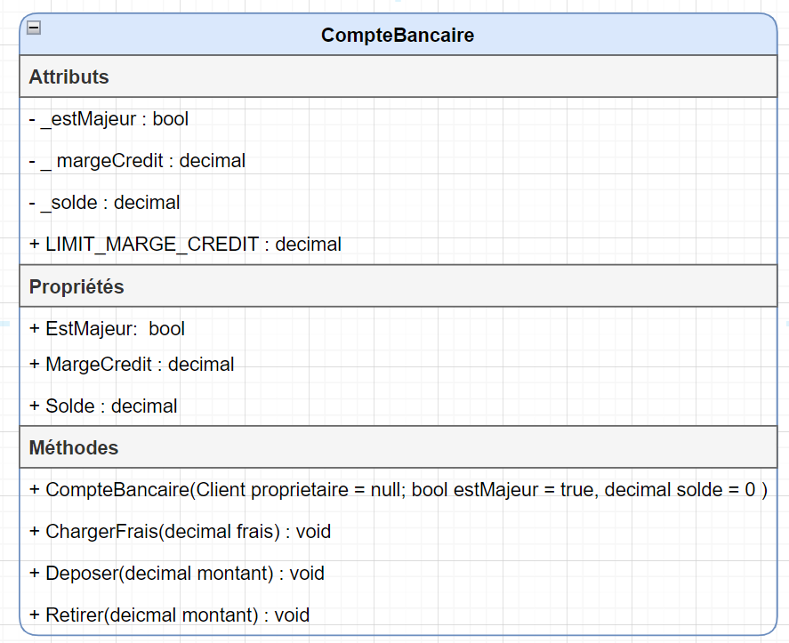
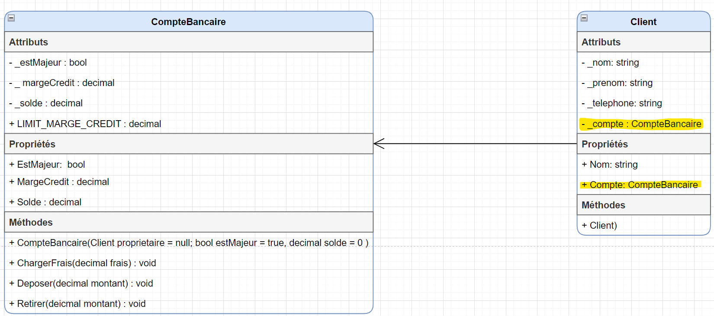
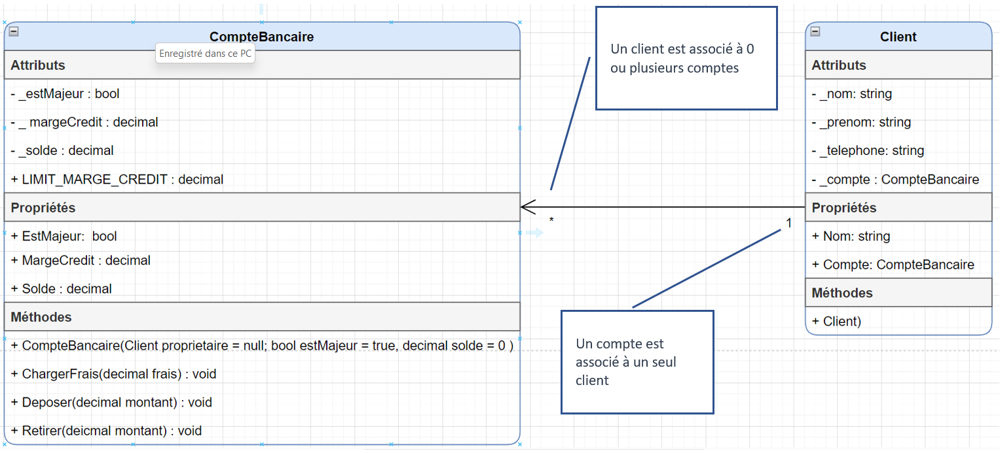
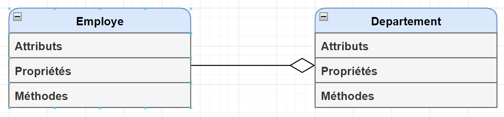
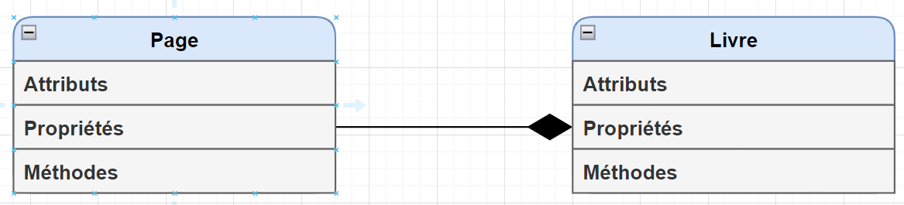
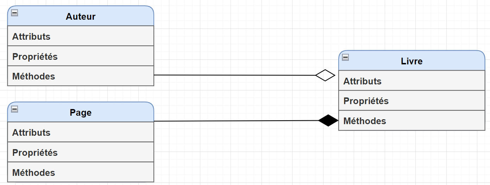
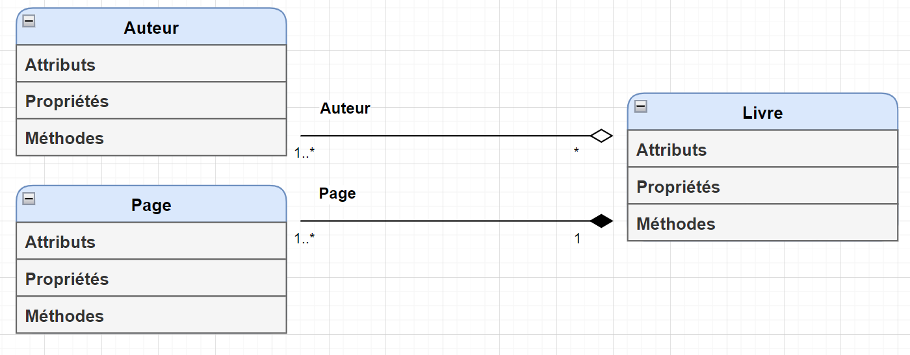
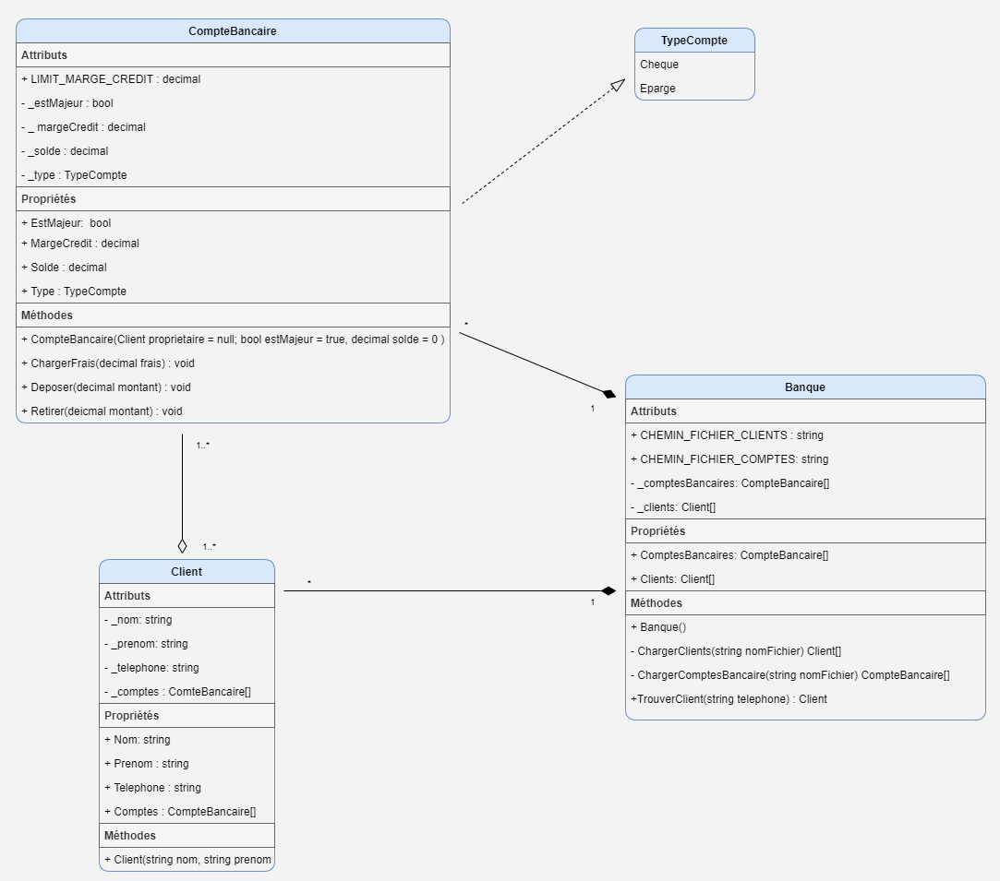

# Relation entre les classes

## Diagramme de classe.

Le diagramme de classe est un schéma permettant de présenter les structures des classes ainsi que les différentes relations entre celles-ci. Le schéma décrit les attributs, les propriétés, les constructeurs et les différentes méthodes d'une classe. Celle-ci indique également le niveau d'accessibilité (public ou private) des différents éléments qui la composent.

Voici un exemple pour la classe CompteBancaire :




**Légende**

    + : public
    - : private
    Majuscule : constantes

## Relation entre les classes

Comme nous l'avons déjà vu, la programmation orientée objet consiste à concevoir une application en utilisant des objets. Chaque objet joue un rôle précis et peut communiquer avec les autres objets. Les interactions entre les différents objets vont permettre à l'application de réaliser les fonctionnalités attendues.

Nous savons qu'un objet est une entité (voiture, compte bancaire, facture, etc.). Un objet est toujours créé d'après un modèle appelé classe.

Jusqu'à présent, nous avons créé des applications qui utilisaient une seule classe. Cependant, il sera très rare qu'une application n'utilise qu'une seule et unique classe. En général, Il faudra définir plusieurs classes et donc instancier des objets de classes différentes. Ces objets devront être mis en relation afin de pouvoir communiquer. Voici les différents types de relations entre classes.

### Association

L'association est une relation de type **"a un"** ou **"a plusieurs"** entre les objets. Nous pouvons définir une relation **un-à-un**, **un-à-plusieurs**, **plusieurs-à-un** et **plusieurs-à-plusieurs** entre les objets. Celle-ci signifie qu'un objet "**utilise**" un autre objet.

Par exemple :
- Un client **a un** compte de banque
- Un livre **a plusieurs** auteurs
- Un gestionnaire **a plusieurs** employés
- Un employé **a un** seul gestionnaire.

Reprenons l'exemple du compte bancaire :



La flèche qui pointe du **Client** vers le **CompteBancaire** indique le sens de navigation de l'association. Une relation d'association implique un lien entre les classes concernées. Ainsi on peut comprendre que la classe **Client** est le **parent** de la classe **CompteBancaire**. **Un client possède un compte bancaire**. 

Pour créer la relation entre Client et CompteBancaire, il est nécessaire d'*ajouter* dans la classe Client un **attribut** de type **CompteBancaire** et la **propriété correspondante**.

### Multiplicité ou cardinalité des associations

Notre définition de la classe CompteBancaire implique qu'un objet de cette classe **a un et un seul** propriétaire. En revanche, rien n'empêche que plusieurs comptes bancaires aient le même client comme titulaire.

Autrement dit, notre modélisation conduit aux règles ci-dessous :
- Une instance de CompteBancaire est associée à une seule instance de Client.
- Une instance de Client peut être associée à un nombre quelconque d'instances de CompteBancaire

Cela se représente graphiquement par l'ajout de multiplicités à chaque extrémité de l'association.



La multiplicité située à une extrémité d'une association indique à combien d'instances de la classe une instance de l'autre classe peut être liée. 

Voici les différents types de multiplicités :

| Multiplicité  |  Signification        |      
| ------------- | :-----------:         | 
| 0..1          | Zéro ou un            | 
| 1             |   Un seul             | 
| *             |   Zéro à plusieurs    | 
| 1..*          |   Un à plusieurs      | 

### Types d'associations 

#### Agrégation

L'agrégation est la relation **"a un"** entre les objets. On peut dire que c'est une association directe entre les objets. Dans l'agrégation, la direction spécifie quel objet contient l'autre objet. **L'objet enfant peut exister sans son parent.**

Par exemple, pour un département et ses employés, **un département (parent) est composé de nombreux employés (enfant)** mais un employé n'est pas associé à plusieurs départements.



Dans cet exemple, les deux classes **ne sont pas dépendantes** l'une de l'autre. C'est-à-dire que chaque objet a son propre cycle de vie. L'objet employé peut exister sans l'objet département.
L'association est représenté par un **losange blanc du côté du parent**.

#### Composition

C'est un type d'agrégation **fort**. Dans ce type d'agrégation, **l'objet enfant n'a pas son propre cycle de vie**. La vie de l'objet enfant dépend du cycle de vie du parent. Seul l'objet parent a un cycle de vie indépendant. **Si nous supprimons l'objet parent, les objets enfants seront également supprimés**. Nous pouvons définir la composition comme une relation **"est composé de"**.

Prenons par exemple une page et un livre. Une page ne peut exister sans le livre, car le livre est composé de pages. Si nous supprimons le livre alors les pages seront supprimées également. La page (objet enfant) n'a pas de cycle de vie indépendant. Elle dépend de la vie de l'objet livre (objet parent).




L'association est représenté par un **losange noir du côté du parent**.


Il possible de combiner l'agrégation et la composition d'objet :



Comme toute association, on doit ajouter les cardinalités des associations :



Ainsi :
- Un Livre est composé d'une ou plusieurs pages
- Une page fait partie d'un livre
- Un Livre est écrit par un pour plusieurs auteurs
- Un Auteur a écrit zéro ou plusieurs livres.

#### Différences entre association et composition


| Agrégation  |  Composition        |      
| ------------- | :-----------         | 
| L'agrégation est un type particulier d'association       | La composition est un type particulier d'agrégation.         | 
| Tous les objets ont leur propre cycle de vie.            | Dans Composition, l'objet enfant n'a pas son propre cycle de vie et cela dépend du cycle de vie du parent.             | 
| Une classe parente n'est pas responsable de la création ou de la destruction de la classe enfant            |   La classe parente est responsable de la création ou de la destruction de la classe enfant.    | 
| L'agrégation peut être décrite comme une relation **« a un »**.         |   La composition peut être décrite comme une relation **« est composé de »** .     | 
|L'agrégation est une association faible.|La composition est une association forte.|
|L'agrégation signifie qu'un objet est le propriétaire d'un autre objet|La composition signifie qu'un objet est contenu dans un autre objet.|


## Travailler avec plusieurs classes
Pour travailler avec plusieurs classes, il est nécessaire de définir une classe principale. Cette classe vous permettra de manipuler les différents objets nécessaires pour l'application. Par Exemple, dans le cas de nos classes **CompteBancaire** et **Client**, nous pourrions avoir une classe principale nommée **Banque** permettant de manipuler des objets de ces deux types.

Ainsi, cette classe pourrait par exemple :
- Créer un tableau de clients à partir de données contenues dans un fichier.
- Créer un nouveau compte bancaire et lui associer un client.
- Rechercher un client ou un compte bancaire

Voici un exemple du diagramme de classes :



Dans cet exemple :

- **Client - Compte** :

    - Un client peut avoir plusieurs comptes.
    - Un compte appartient à un ou plusieurs clients (si l'on considère les comptes joints).
    - La durée de vie d'un compte dépend généralement de celle de son client. Si un client ferme son compte ou quitte la banque, le compte n'existe plus. Cependant, dans ce cas-ci étant donné qu'un compte peut avoir plusieurs client alors on ne supprime le compte du client.
    - Ceci est généralement représenté comme une relation de **aggrégation** (en particulier, si on assume que la suppression d'un client n'entraine pas la suppression de tous ses comptes).

- **Banque - Compte** :

    - Une banque a plusieurs comptes.
    - Un compte appartient à une seule banque.
    - Si une banque ferme ou est supprimée, tous ses comptes sont supprimés.
    - Ceci est représenté comme une relation de composition.

- **Banque - Client** :

    - Une banque a plusieurs clients.
    - Un client appartient généralement à une seule banque (pour simplifier, même si dans la réalité, un client peut être associé à plusieurs banques).
    - Dans ce cas si, on suppose qui **si une banque ferme, alor les information du client sont supprimé**. Ceci est représenté comme une relation de **composition**.
    - Dans le cas où les informations du client devraient être conservées pour des raisons réglementaires où si le client pourrait appartenir à plusieur banques dans le système, alors le client peut toujours exister sans être associé à une banque. Ceci serait alors représenté comme une relation d'**aggrégation**.
    

Voici un exemple de cette classe :

```c#
/// <summary>
/// Classe permettant la gestion des comptes bancaires et des clients
/// </summary>
class Banque
{

    //Attributs
    private Client[] _tabClients;
    private CompteBancaire[] _tabComptesBancaires;

    //Propriétés
    public Client[] tabClients
    {
        get { return _tabClients; }
        set { _tabClients = value; }
    }


    public CompteBancaire[] tabComptesBancaires
    {
        get { return _tabComptesBancaires; }
        set { _tabComptesBancaires = value; }
    }

    //Constructeur.
    public Banque()
    {
        tabClients = ChargerClients(CHEMIN_FICHIER_CLIENT);
        tabComptesBancaires = ChargerComptesBancaires(CHEMIN_FICHIER_CLIENT);
    }

    private Client[] ChargerClients(string cheminFichier)
    {
        //Code permettant le chargement des clients à partir du fichier
            …
    }

    private CompteBancaire[] ChargerComptesBancaires(string cheminFichier)
    {
        //Code permettant le chargement des comptes bancaires à partir du fichier

    }

    public Client TrouverClient(string telephone)
    {
        //Code permettant de trouver un client dans vecClients à partir d'un numéro de téléphone

    }
}

```

Voici un exemple d'utilisation de cette classe à l'intérieur d'un programme :

```c#
Banque maBanque = new Banque();
Client unClient = maBanque.TrouverClient("418-688-8310"):
Console.WriteLine("Le nom du client trouvé est :" + unClient.Nom);

```

## Outils pour créer des diagrammes de classes

Il exite plusieurs logiciels permettant la création de diagrammes de classes. Dans le cadre du cours, nous utiliseron le logiciel gratuit Draw.io. 

Téléchargement du logiciel : https://github.com/jgraph/drawio-desktop/releases/download/v31.3.2/draw.io-31.3.2-windows-installer.exe

Afin de faciliter le design de vos diagrammes, j'ai créé une librairie contenant déjà les différentes formes à utiliser. 

1) Télécharger la librairie : [modèle](https://gitlab.com/420-14b-fx/contenu/-/raw/main/en_vrac/Bloc-notes.xml?ref_type=heads&inline=false) 

2) Pour installer la librairie : 

    - Dans l'application draw.io, cliquer sur le menu `Fichier --> Ouvrir une librairie`
    - Sélectionner le fichier que vous avez téléchargé (Bloc-notes.xml)


## Démo - Relations
Télécharger la démonstration de départ : [S3C1-ExempleMobilierCuisine.zip](https://github.com/imane-mez/14B-POO-A26-Exercices/blob/main/D%C3%A9mos/Cours%205/ExempleMobilierCuisine%20-%20D%C3%A9part.zip)

En partant de la démo et du [diagramme de classes](https://github.com/imane-mez/14B-POO-A26-Exercices/blob/main/D%C3%A9mos/Cours%205/mobilier-cuisine.pdf), écrire un programme permettant de créer un mobilier de cuisine constitué d'une table et d'un certain nombre de chaises. Le programme doit ainsi permettre de calculer le prix de vente du mobilier après avoir appliqué une réduction de 7% par rapport aux prix d'origine des articles s'ils étaient vendus séparément.
- Coder la classe MobilierCuisine. La classe doit permettre de calculer le prix de vente, le nombre de chaises et retourner une chaise en spécifiant son indice dans le tableau de chaises.
- Dans program.cs :
	- Créer un mobilier constitué d'une table et de 6 chaises (4 ordinaires et 2 capitaines).
	- Afficher les informations du mobilier telles que le prix de vente, le nombre de chaises, le modèle et le prix de la table, le modèle ainsi que le prix de vente de la chaise d'indice 3.


<!--
Télécharger la démonstration complète : [S3C1-DemoComposition.zip](https://gitlab.com/420-14b-fx/contenu/-/tree/main/bloc1/cours%2005?ref_type=heads)-->


