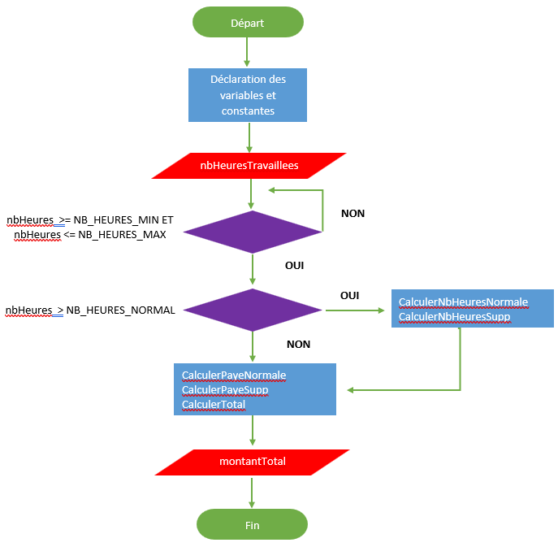

# La pensée computationnelle 

Mais qu'est-ce que la pensée computationnelle exactement? Jetons un coup d'œil à une définition technique ...

<i>"La pensée computationnelle est le processus de pensée impliqué dans la formulation des problèmes et de leurs solutions afin que les solutions soient représentées sous une forme qui peut être efficacement réalisée par un système de traitement de l'information (un ordinateur). " </i>

La pensée computationnelle pourrait être décrite tout simplement comme « **penser comme un informaticien** ».

## Les 4 composantes de la pensée computationnelle

### La décomposition

Avant que les ordinateurs ne puissent résoudre un problème, le problème et les moyens de le résoudre doivent être compris. La décomposition aide en décomposant les problèmes complexes en petites parties plus faciles à gérer.

**Qu'est-ce que la décomposition?**

La décomposition implique de décomposer un problème ou un système complexe en parties plus petites qui sont plus faciles à gérer et à comprendre. Les plus petites pièces peuvent ensuite être examinées et résolues, ou conçues individuellement, car elles sont plus simples à utiliser.

**Pourquoi la décomposition est-elle importante?**

Si un problème n'est pas décomposé, il est beaucoup plus difficile à résoudre. Il est beaucoup plus difficile de traiter simultanément de nombreuses étapes différentes que de décomposer un problème en plusieurs petits problèmes et de résoudre chacun d'entre eux, un à la fois. Décomposer le problème en parties plus petites signifie que chaque problème plus petit peut être examiné plus en détail.
De même, il est plus facile d'essayer de comprendre le fonctionnement d'un système complexe en utilisant la décomposition. Par exemple, comprendre comment fonctionne un ordinateur est plus simple si l’ordinateur entier est séparé en parties plus petites et que chaque partie est examinée pour voir comment cela fonctionne plus en détail.

**La décomposition en pratique**

Nous effectuons de nombreuses tâches au quotidien sans même y penser - ou les décomposer - comme le brossage des dents.

**Exemple 1: Se brosser les dents**

Pour décomposer le problème de la façon de se brosser les dents, il faudrait considérer:
- quelle brosse à dents utiliser
- combien de temps brosser
- avec quelle force appuyer la brosse sur nos dents
- quel dentifrice utiliser

**Exemple 2: Résoudre un crime**

Ce n'est normalement que lorsqu'on nous demande de faire une tâche nouvelle ou plus complexe que nous commençons à y réfléchir en détail - à décomposer la tâche.

Imaginez qu'un crime a été commis. Résoudre un crime peut être un problème très complexe, car il y a beaucoup de choses à considérer.
Par exemple, un policier aurait besoin de connaître la réponse à une série de problèmes mineurs:
- quel crime a été commis
- quand le crime a été commis
- où le crime a été commis
- quelles preuves il y a
- s'il y avait des témoins
- s'il y a eu récemment des crimes similaires

Le problème complexe du crime commis a maintenant été décomposé en problèmes plus simples qui peuvent être examinés individuellement, en détail.

### La reconnaissance des entités (modèles)

Une fois que nous avons décomposé un problème complexe, cela aide à examiner les petits problèmes à la recherche de similitudes ou de « modèles ». Une entité est un concept abstrait qui représente une chose ou un concept du monde réel. Dans la modélisation de données ou dans la conception logicielle, une entité peut être représentée par un ensemble de caractéristiques. 

Imaginez que nous voulons dessiner une série de chats.

Tous les chats partagent des caractéristiques communes. Entre autres, ils ont tous des yeux, des queues et de la fourrure. Ils aiment aussi manger du poisson et émettre des miaulements.

Parce que nous savons que tous les chats ont des yeux, une queue et une fourrure, nous pouvons faire une bonne tentative pour dessiner un chat, simplement en incluant ces caractéristiques communes.

 Une fois que nous savons comment décrire un chat, nous pouvons en décrire d'autres, simplement en suivant ce schéma. Les seules choses qui diffèrent sont les spécificités:
- un chat peut avoir les yeux verts , une longue queue et une fourrure noire
- un autre chat peut avoir les yeux jaunes , une queue courte et une fourrure rayée.

Maintenant si nous voulons dessiner un chat, il est simple de le faire. Nous savons que tous les chats suivent ce modèle, nous n'avons donc pas à nous arrêter chaque fois que nous commençons à dessiner un nouveau chat pour résoudre ce problème. À partir de l'entité chat que nous avont défini, nous pouvons rapidement dessiner plusieurs chats.

**Trouver les entités**

Pour trouver les entités à l'intérieur d'un problème, il s'agit de **trouver les éléments identiques ou très similaires**.

Par exemple, la tâche de préparer un gâteau peut être décomposée en différents petits problèmes (étapes) :

- Quel est le genre de gâteau?
- Quels sont les ingrédients et la quantité de chacun?
- Pour combien de personnes?
- Quel est le temps de cuisson?
- Quand est-ce ajouter chaque ingrédient?
- Etc.

Une fois que nous savons comment faire un type de gâteau, il est simple de voir que préparer d'autre type de gâteau n'est pas si différent.

- Chaque gâteau aura besoin d'un certain nombre d'ingrédients
- Les ingrédients seront ajoutés à un moment précis
- Chaque gâteau aura un temps de cuisson
- Etc.

Une fois les entités identifiés, il est possible de trouver des solutions communes entre les problèmes : 

- Préchauffer le four à la température X.
- Mélanger une quantité X d'un ingrédient Y.
- Cuire pendant X temps.

### L'abstraction

Une fois que nous avons identifié des entités dans nos problèmes, nous utilisons l'abstraction pour rassembler les caractéristiques générales et pour filtrer les détails dont nous n'avons pas besoin pour résoudre notre problème.

L'abstraction est le processus de filtrage - ignorant - les caractéristiques des entités dont nous n'avons pas besoin.

Précédemment, nous avons identifié les modèles nous permettant de dessiner des chats. Nous avons noté que tous les chats ont des caractéristiques générales, communes à tous les chats, par exemple des yeux, une queue, une fourrure, un goût pour les poissons et la capacité de miauler. 

De plus, chaque chat a des caractéristiques spécifiques comme une fourrure noire, une longue queue, des yeux verts, un amour du saumon et un miaulement fort. Celles-ci sont en fait des détails.

Pour dessiner un chat de base, nous devons savoir qu'il a une queue, de la fourrure et des yeux. Ces caractéristiques sont pertinentes. Cependant, nous n'avons pas besoin de connaître le son qu'il fait ou s'il aime le poisson. Ces caractéristiques ne sont pas pertinentes et peuvent être filtrées.

L'abstraction nous permet de créer une idée générale de ce qu'est le problème et comment le résoudre. Le processus nous demande de supprimer tous les détails spécifiques de toutes les entités qui ne nous aideront pas à résoudre notre problème. 

**En pratique** 

Lors de la cuisson d'un gâteau, il existe certaines caractéristiques générales entre les gâteaux. Par exemple:

- Un gâteau a besoin d'ingrédients
- Chaque ingrédient a besoin d'une quantité spécifiée
- Un gâteau a besoin d'un temps de cuisson

Lors de l'abstraction, nous supprimons des détails spécifiques et conservons caractéristiques générales pertinentes.

| Caractéristiques générales          | détails spécifique |
| :-----------                        | :------------ | 
|Nous devons savoir qu'un gâteau a des ingrédients.| Nous n'avons pas besoin de savoir quels sont ces ingrédients|
|Nous devons savoir que chaque ingrédient a une quantité spécifiée|Nous n'avons pas besoin de savoir quelle est cette quantité|
|Nous devons savoir que chaque gâteau a besoin d'un temps de cuisson|Nous n'avons pas besoin de savoir combien de temps il faut|

Une fois l'entité identifié et ses caractéristique générales, nous pouvons identifier les comportements. Par exemple, dans l'exemple du chat : 

| Caractéristiques générales          | détails spécifique |
| :-----------                        | :------------ | 
|Un chat peu manger                   |Nous n'avons pas besoin de savoir qu'est-ce qu'il mange
|Un chat peu miauler                  |Nous n'avons pas besoin de savoir le type de miaulement (fort ou faible)


### l'algorithme et le code

Une fois l'entité identifié, ses caractéristique générales et ses comportements, il ne nous reste qu'à écrire l'algorithme et le code pour résoudre le problème.

## Exemple de décomposition de problème 


### Problème
La rémunération hebdomadaire d'un employé dépend du taux de rémunération et du nombre d'heures travaillées par semaine. Les employés travaillent au moins une heure par semaine et au maximum 60. Un employé qui travaille plus de 40 heures est payé 1,5 fois son taux de rémunération pour toutes les heures travaillées au-delà de 40. Le salaire minimum est de 15$ par heure. Un programme est nécessaire pour calculer et produire la paie hebdomadaire de tout employé.

**1) Décomposer le problème global en plusieurs problèmes plus petits et plus faciles à résoudre.**

- Connaître le nombre d'heures travaillées
- Connaître combien de ces heures doivent être payées au taux normal
- Connaître combien de ces heures, le cas échéant, doivent être payées au taux des heures supplémentaires
- Calculer le salaire pour les heures normales
- Calculer le salaire des heures supplémentaires
- Additionner la rémunération des heures normales et supplémentaires
- Afficher le résultat

**2) Identifier les entités ainsi que leur caractéristiques et comportements**

- Employe :
    - Caractéristiques :
        - Nom
        - Prénom
        - Taux horaire
    - Comportement :
        - Aucun


**3) Identifier les variables en entrée et en sortie et les constantes qui seront nécesssaires**

|Variable                           |Type de données    |Entrée/Sortie  |
|:----------                        |:-----------       |:-----------   |
|noEmploye                          |	ushort	        | Entrée        |
|nom                                |	string	        | Entrée        |
|prenom                             |	string	        | Entrée        |
|tauxHoraire                        |	decimal	        | Entrée        |
|vectEmployes                       |	Employe[]       | Entrée        |
|nbHeuresNormales                   |	byte	        | Entrée        |
|nbHeuresSupp                       |	byte            |	-           |
|montantHeuresNormales              |	decimal         |   -           |
|montantHeuresSupp                  |	decimal         |	-           |
|montantTotal                       |	decimal         | Sortie        |


|Constantes                         |Type de données    |
|:----------                        |:-----------       |
|TAUX_HORAIRE_SUPPLEMENTAIRE        |	float	        |
|NB_HEURES_MAX                      |	byte	        |
|NB_HEURES_MIN                      |	byte	        |
|NB_HEURES_NORMAL                   |	byte            |


**4) Idenifier les fonctions ainsi que leurs entréeet sortie.**

|Fonctions                          |Entrée(s)                 |Sortie                 |
|:----------                        |:-----------           |:-----------           |
|CalculerNbHeuresNormale            |	nbHeuresTravaillees | nbHeuresNormales      |
|CalculerNbHeuresSupp               |	nbHeuresTravaillees | nbHeuresSupp          |
|CalculerPayeNormale                |	nbHeuresNormales    | montantHeuresNormales |
|CalculerPayeSupp                   |	nbHeuresSupp        | montantHeuresSupp     |
|CalculerTotal                      |	montantHeuresNormales, montantHeuresSupp | montantTotal            |

**5) Écrire l'algorithme et coder la solution**



## Exercices
::: tip S1E2 - Résolution de problème

### Problème 1 - Restaurant

Un restaurateur vous demande de créer une application console qui calculera automatiquement la facture d'un client.  L'application demandera le prix d'un apéritif, d'une entrée, d'un plat principal, d'un dessert et d'une bouteille de vin.  Si un des items n'a pas été pris, sa valeur sera à 0. À partir de ces valeurs, l'application doit calculer et afficher le sous-total de la facture du client.  À ce sous-total, elle ajoute un pourboire obligatoire de 15% et une taxe de consommation de 10% et affiche ce total.  Finalement, l'application doit également servir à calculer la monnaie à rendre au client.  Il demande le montant donné par le client et affiche la monnaie à lui rendre. Gardez en tête qu'il se peut que l'on désire conserver chaque facture créée en mémoire.

1) Décomposer le problème global en plusieurs problèmes plus petits et plus faciles à résoudre.
2) Identifier les entités ainsi que leur caractéristiques et comportements
2) Identifier les variables en entrée et en sortie et les constantes qui seront nécesssaires
3) Idenifier les fonctions ainsi que leurs entréeet sortie.
4) Programmer la solution.

### Problème 2 - Jeu du pendu

Vous devez créer une application qui permettra à l'utilisateur de jouer au pendu contre l'ordinateur ( [https://fr.wikipedia.org/wiki/Le_Pendu_(jeu)](https://fr.wikipedia.org/wiki/Le_Pendu_(jeu))).


En bref, l'ordinateur choisit le mot et le joueur essaie de deviner les lettres dans le mot. Vous n'avez pas à dessiner le pendu vous n'avez qu'à indiquer le nombre de tentatives restantes. 

De plus, un utilisateur ne peut pas saisir deux fois la même lettre. 

L'ordinateur doit sélectionner un mot au hasard dans la liste des mots disponibles qui a se trouve dans le fichier  [mot.txt](https://gitlab.com/420-14b-fx/contenu/-/raw/main/bloc1/cours%2002/mots.txt?ref_type=heads&inline=false) et indique au joueur le nombre de lettres constituant le mot (_).

Notez que mots.txt contient des mots **anglais** dont toutes les lettres sont en minuscules.

Vous pouvez réutiliser les fonctions de lectures et d'écritures du fichier **FonctionUtiles.cs** fournies dans l'exercice **S1E1 - Révision**.

Vous aurez besoin d'obtenir un nombre aléatoire afin de choir un mot. Voici un exemple pour obtenir un nombre aléatoire entre 0 et 10 :
```C#
Random aleatoire = new Random();

//Génère un entier aléatoire positif. La borne supérieure est exclue du résultat.
int entier = aleatoire.Next(0,11); 
```


Voici un exemple du résultat attendu : 

```tex
Le mot à découvrir est : _ _ _ _ _ _ _

Lettres utilisées:
Nombre d'essais restant : 6

Veuillez saisir une lettre : i

-------------------------------------------------
Le mot à découvrir est : _ _ _ _ _ _ _

Lettres utilisées: i
Nombre d'essais restant : 5

Veuillez saisir une lettre : a

------------------------------------------------
Le mot à découvrir est : _ _ _ _ a _ _

Lettres utilisées: ia
Nombre d'essais restant : 5

Veuillez saisir une lettre :
```


### Solution de l'exercice 

 [S1E2-ResolutionProblemes-Solution.zip](https://gitlab.com/420-14b-fx/contenu/-/blob/main/bloc1/cours%2002/S1E2-ResolutionProblemes-Solution.zip?ref_type=heads)
:::