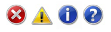
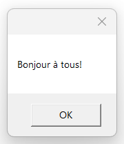
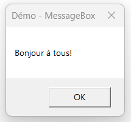
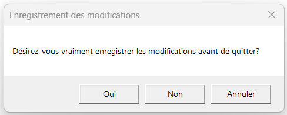
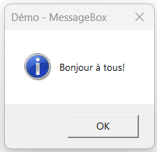
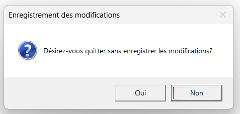

# Rétroaction utilisateur

## Les messages d'erreurs

- **Ne donnez pas de messages d'erreur lorsque les utilisateurs ne sont pas susceptibles d'effectuer une action ou de modifier leur comportement à la suite du message**. S'il n'y a aucune action que les utilisateurs peuvent entreprendre, ou si le problème n'est pas significatif, supprimez le message d'erreur.

- **Dans la mesure du possible, proposez une solution afin que les utilisateurs puissent résoudre le problème**. Cependant, assurez-vous que la solution proposée est susceptible de résoudre le problème. Ne perdez pas de temps aux utilisateurs en suggérant une solution possible, mais improbable.

- **Soyez spécifique**. Évitez les mots vagues, tels que « une erreur s'est produite ». Fournissez des noms, des lieux, et les valeurs des objets impliqués.

- **N'utilisez pas de formulation qui blâme l'utilisateur ou implique une erreur de l'utilisateur**. Évitez d'utiliser le mot « vous » et « votre », dans la formulation de la phrase. Utilisez la voix passive lorsque l'utilisateur est le sujet et pourrait se sentir blâmé pour l'erreur si la voix active était utilisée.


- N'utilisez pas les mots suivants:
    - Erreur, échec (utilisez plutôt problème)
    - Échec de (utilisez à la place impossible)
    - Illégal, invalide, mauvais (utilisation incorrecte ou non valide à la place)
    - Abandonner, tuer, terminer (utilisez plutôt arrêter)
    - Catastrophique, mortel (utilisez plutôt grave)

- **N'accompagnez pas les messages d'erreur d'effets sonores**. Cela est choquant et inutile.

## Les icônes pour les messages



Les icônes standard ont ces significations:

- Icône d'erreur : L'interface utilisateur (UI) présente une erreur ou un problème qui s'est produit.
- Icône d'avertissement : L'interface utilisateur présente une condition qui pourrait causer un problème à l'avenir.
- Icône d'information : L'interface utilisateur présente des informations utiles.
- Icône de point d'interrogation : L'interface utilisateur indique un point d'entrée d'aide où une demande à l'utilisateur qui n'est pas une erreur ou un avertissement.

### Utilisation

Il y a plusieurs facteurs dans le choix de l'icône standard appropriée qui explique en partie pourquoi ils sont souvent mal utilisés. **Les erreurs les plus courantes** sont:

- **Utilisation d'une icône d'avertissement pour les erreurs mineures**. Les avertissements ne sont pas des erreurs "adoucies".
- Utiliser une icône standard lorsqu'il est préférable de ne pas utiliser d'icône du tout. **Tous les messages n'ont pas besoin d'une icône**.
- Alerter les utilisateurs en donnant des **avertissements pour des problèmes mineurs ou en présentant des questions de routine comme des avertissements**. Ce faisant, rends les programmes susceptibles de présenter des risques et évite les problèmes véritablement importants.

Choisissez des icônes standard en fonction du type de message et non de la gravité du problème sous-jacent. Les types de messages sont:

- **Erreur** : Une erreur ou un problème qui se sont produits.
- **Avertissement** : Une condition qui pourrait causer un problème à l'avenir.
- **Information**. Informations utiles.

Par conséquent, **un message d'erreur peut prendre une icône d'erreur, mais jamais une icône d'avertissement**. N'utilisez pas d'icônes d'avertissement comme un moyen d'adoucir les erreurs mineures. Ainsi, malgré leur différence de gravité, "Taille de police incorrecte" est une erreur, alors que « Continuer cette opération mettra le feu à votre maison » est un avertissement.

## Déterminer le bon type de message 

Certains problèmes peuvent être présentés comme une erreur, un avertissement ou une information, en fonction de l'emphase et de la formulation.

Par exemple, supposons qu'une page Web ne puisse pas charger un contrôle ActiveX non signé basé sur la version du navigateur utilisé :

- Erreur. "Cette page ne peut pas charger un contrôle ActiveX non signé." (Formulé comme un problème existant.).

- Avertissement. "Cette page peut ne pas se comporter comme prévu, car votre navigateur n'est pas configuré pour charger les contrôles ActiveX non signés. " ou "Autoriser cette page à installer un contrôle ActiveX non signé? Faire cela à partir des sources non fiables peut endommager votre ordinateur.". (Ces deux termes sont des conditions susceptibles de causer des problèmes futurs.).

- Information. "Vous avez configuré votre navigateur pour bloquer les contrôles ActiveX non signés." (Formulé comme une déclaration de fait.).

Pour déterminer le type de message approprié, concentrez-vous sur l'aspect le plus important du problème que les utilisateurs doivent savoir ou agir sur. 

En règle générale,

 - Si un problème empêche l'utilisateur de continuer à utiliser correctement l'application, il est présenté comme une Erreur; 
 - Si l'utilisateur peut continuer à utiliser l'application, c'est un Avertissement. Élaborez l'instruction principale ou tout autre texte correspondant basé sur cette idée, puis choisissez une icône (standard ou autre) qui correspond au texte. Le texte de l'instruction principale et les icônes doivent toujours correspondre.

**La gravité**

Bien que la gravité ne soit pas une considération lors du choix parmi les icônes d'erreur, d'avertissement et d'information, la gravité est un facteur pour déterminer si une icône standard doit être utilisée.

Les icônes fonctionnent mieux lorsqu'elles sont utilisées pour communiquer visuellement. Les utilisateurs doivent pouvoir dire en un coup d'œil la nature des informations et les conséquences de leur réponse, il faut donc différencier erreurs critiques et avertissements de leurs homologues ordinaires. 

Les erreurs et avertissements critiques ont ces caractéristiques:

- Ils impliquent la perte potentielle d'un ou de plusieurs des éléments suivants:
    - Un atout précieux, comme une perte de données ou une perte financière.
    - Accès au système ou intégrité.
    - Confidentialité ou contrôle des informations confidentielles.
    - Temps de l'utilisateur (une quantité importante, par exemple 30 secondes ou plus).
- Ils ont des conséquences inattendues ou involontaires.
- Ils nécessitent une manipulation correcte maintenant, car les erreurs ne peuvent pas être facilement corrigées et peuvent même être irréversibles.

Pour distinguer les erreurs et avertissements non critiques des erreurs critiques :

 - Les messages non critiques sont généralement affichés **sans icône**. Cela attire l'attention sur les messages critiques, rend les messages critiques et non critiques visuellement distincts, et est cohérent avec le ton de Windows. 

**Tous les messages n'ont pas besoin d'une icône. Les icônes ne sont pas un moyen de décorer les messages.**


## Évitez de suravertir.

Dans une interface utilisateur classique, la plupart des erreurs sont liées à des erreurs de saisie utilisateur. La plupart des erreurs de saisie utilisateur ne sont pas critiques, car facilement corrigées, et les utilisateurs doivent les corriger avant de continuer. Aussi, attirer trop l'attention sur les erreurs mineures de l'utilisateur est contraire au ton de Windows. **Par conséquent, des erreurs de saisie par un utilisateur sont généralement affichées sans icône d'erreur.**

Nous avons tendance à suravertir dans les programmes Windows. Le programme Windows typique a des icônes d'avertissement apparemment partout, avertissant sur des choses qui ont peu d'importance. 

Dans certains programmes, presque chaque question est présentée comme un avertissement. La suralerte donne l'impression que l'utilisation d'un programme est une activité dangereuse et nous distrait de problèmes importants.

**Le simple potentiel de perte de données à lui seul est insuffisant pour utiliser une icône d'avertissement**. IL doit être accompagné de résultats indésirables qui devraient être inattendus ou involontaires et qui ne sont pas facilement corrigibles. Sinon, à peu près toute question répondue de façon incorrecte peut être interprétée comme entraînant une perte de données quelconque et mériter une icône d'avertissement.

Pour utiliser des **icônes d'avertissement sur des problèmes vraiment critiques**:

- **Assurez-vous que le problème justifie une attention accrue de l'utilisateur**. Les confirmations et questions de routine ne devraient pas avoir des icônes d'avertissement.

- **Les utilisateurs sont-ils susceptibles de se comporter différemment en raison de l'icône d'avertissement?** Les utilisateurs sont-ils susceptibles de considérer leur décision plus soigneusement?

## À quel moment donner une rétroaction utilisateur.

Voici les moments où vous devriez donner une rétroaction à un utilsateur :

- **Soumission de Formulaire** :
    - Succès: Informer l'utilisateur que le formulaire a été soumis avec succès.
    - Échec: Expliquer pourquoi la soumission a échoué et comment résoudre le problème.
- **Chargement et Temps d’Attente** (Dans le cas où le chargement peut être long) :
    - Indicateur de Chargement: Fournir une indication visuelle lorsque le contenu ou une fonctionnalité est en cours de chargement.
    - Progression: Montrer une barre de progression ou un autre indicateur pour les tâches longues.
- **Confirmation d’Actions** :
    - Demander confirmation pour les actions irréversibles (comme la suppression de données).
    - Fournir un feedback de confirmation après des actions importantes (ex: sauvegarde réussie, suppression réussie).
- **Erreurs Système** :
    - Informer l'utilisateur en cas d'erreur système ou de problème de connexion.


## Afficher un message à l'utilisateur en WPF

WPF propose plusieurs boîtes de dialogue que votre application peut utiliser, mais la plus simple est sans aucun doute la **MessageBox**. Son seul but est de montrer un message à l'utilisateur, puis de proposer à l'utilisateur une ou plusieurs façons de répondre au message.

La **MessageBox** est utilisée en appelant la méthode statique **Show()**, qui peut prendre une gamme de paramètres différents, pour pouvoir se présenter et se comporter comme vous le souhaitez. Nous allons passer en revue toutes les différentes formes possibles, avec chaque variation représentée par la ligne MessageBox.Show() et une capture d'écran du résultat. 

Dans sa forme la plus simple, la MessageBox ne prend qu'un seul paramètre, qui est le message à afficher :

```c#
MessageBox.Show("Bonjour à tous!");
```



### MessageBox avec un titre

```c#
MessageBox.Show("Bonjour à tous!", "Démo - MessageBox");
```




### MessageBox avec des boutons supplémentaires

Par défaut, le MessageBox n'a qu'un seul bouton Ok, mais cela peut être modifié, au cas où vous voudriez poser une question à votre utilisateur et pas seulement montrer une information. 

```c#
MessageBox.Show("Désirez-vous vraiment supprimer cet enregistrement?", 
    "Suppression d'un élément", 
    MessageBoxButton.YesNo);
```

Vous contrôlez les boutons affichés en utilisant une valeur de l'énumération **MessageBoxButton** - dans ce cas, un bouton Oui, Non est inclus. Les valeurs suivantes peuvent être utilisées :
- OK
- OKCancel
- YesNoCancel
- YesNo

Maintenant, vous avez besoin d'un moyen de voir ce que l'utilisateur a choisi, et heureusement, la méthode **MessageBox.Show()** renvoie toujours une valeur de l'énumération **MessageBoxResult** que vous pouvez utiliser. 

En vérifiant la valeur du résultat de la méthode MessageBox.Show(), vous pouvez maintenant réagir au choix de l'utilisateur, comme on le voit dans cet exemple : 

```c#
MessageBoxResult result = MessageBox.Show("Désirez-vous vraiment enregistrer les modifications avant de quitter?", 
    "Enregistrement des modifications", 
    MessageBoxButton.YesNoCancel);

switch (result)
{
               
    case MessageBoxResult.Cancel:
        MessageBox.Show("L'opération est annulée et aucune modification n'a été enregistrée.");
        break;
    case MessageBoxResult.Yes:
        MessageBox.Show("Les modifications ont été enregistrées et vous avez quitté l'application.");
        break;
    case MessageBoxResult.No:
        MessageBox.Show("Aucune modification n'a été enregistrée et vous avez quitté l'application.");
        break;
    default:
        break;
}


```



### MessageBox avec une icône

La MessageBox a la capacité d'afficher une icône prédéfinie à gauche du message texte, en utilisant un quatrième paramètre :

```c#
MessageBox.Show("Bonjour à tous!", "Démo MessageBox", 
    MessageBoxButton.OK,
    MessageBoxImage.information);
```



À l'aide de l'énumération **MessageBoxImage** , vous pouvez choisir entre une gamme d'icônes pour différentes situations. Voici la liste complète :

- Asterisk
- Error
- Exclamation
- Hand
- Information
- None
- Question
- Stop
- Warning

### MessageBox avec une option par défaut

Le **MessageBox** sélectionnera un bouton comme choix par défaut, qui est alors le bouton appelé au cas où l'utilisateur appuie simplement sur « Entrée»  une fois la boîte de dialogue affichée. Par exemple, si vous affichez un MessageBox avec un bouton « Oui » et un bouton « Non », « Oui » sera la réponse par défaut. Vous pouvez cependant modifier ce comportement en utilisant un cinquième paramètre de la méthode **MessageBox.Show()**.

Pour éviter que l’utilisateur commette une erreur (par exemple lors d’une suppression d’un enregistrement, en appuyant trop rapidement sur la touche « Entrée »), **il est une bonne pratique de mettre le bouton par défaut sur « Non » ou « Annuer »**. Ainsi, l’utilisateur devra consciemment cliquer sur le bouton « Oui » ou « Ok » pour confirmer l’action.

```c#
MessageBox.Show("Désirez-vous quitter sans enregistre les modifications?", 
    "Enregistrement des modifications", 
    MessageBoxButton.YesNo, 
    MessageBoxImage.Question, 
    MessageBoxResult.No);
```



