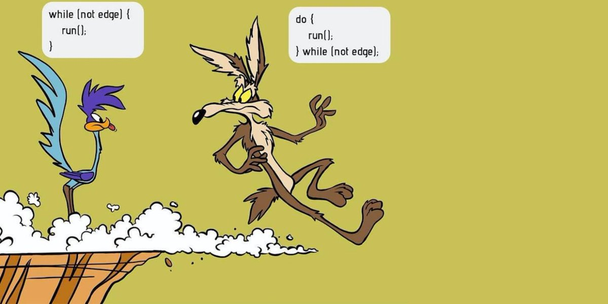
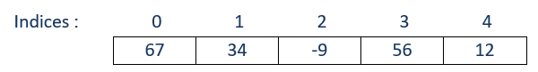

# Révision du cours Introduction à la programmation (420-04A-FX)


## Les Types


**Entier**

````c#
int unEntier;

````
**Double**

````c#
double unDouble;

````
**Caractère**

````c#
char unCar;

````

**Chaîne de caractères**

````c#
string uneChaine;

````

**Booléen**

````c#
bool unBool;

````

::: danger Important
Une instruction en C# se termine par un **;**

Un bloc d'instructions en C# est délimité par des accolades : **\{ instructions \}**
:::

## Opérations élémentaires

**Concaténation**

````c#
string str = uneChaine + autreChaine;

````
**Addition**

````c#
nombreUn = nombreDeux + nombreTrois;

````
**Soustraction**

````c#
nombreUn = nombreDeux - nombreTrois;

````
**Multiplication**

````c#
nombreUn = nombreDeux * nombreTrois;

````

**Division**

````c#
nombreUn = nombreDeux / nombreTrois;

````
::: warning Attention
**/** peut désigner autant la division entière que réelle. Le résultat sera différent.
:::

## raccourcis sur les opérations
````c#
unNombre++ ;			// unNombre = unNombre + 1 	
unNombre += nb; 		// unNombre = unNombre + nb
unNombre-- ;			// unNombre = unNombre - 1 
unNombre -= nb; 	    // unNombre = unNombre - nb
unNombre *= nb; 		// unNombre = unNombre * nb
unNombre /= nb; 		// unNombre = unNombre / nb
unNombre %= nb; 		// unNombre = unNombre % nb
````

::: info 
**%** est l'opérateur modulo qui représente le reste d'une division entière.
:::

## Conversion 

**ToString**
````c#
string strCh = unNombre.ToString();	    // Convertir un nombre en chaîne
````

**Convert**
````c#
int nb = Convert.ToInt32(str) ;	            // Convertir en nombre entier
double dble = Convert.ToDouble(str) 	    // Convertir en double
````

## Lecture du clavier


````c#
string uneChaine = Console.ReadLine();                  //Chaîne de caractères
int unEntier = Convert.ToInt32(Console.ReadLine());     //Entier
double unDouble = Convert.ToDouble(Console.ReadLine()); //Double.
bool bln = Convert.ToBoolean(Console.RadLine()) ;       //Booléen.
char unCar = Console.ReadKey();                         //Caractère

Console.ReadKey() ;	// Attendre que l'utilisateur pèse sur une touche
````

## Écriture à la console

**Un message**

````c#
Console.WriteLine("Voici un message");
````
**Une variable**

````c#
string unMessage = "Bonjour";
Console.WriteLine(unMessage) ;
````

**Un message avec valeur**

````c#
string nombre = 10;
Console.WriteLine("La valeur de nombre est : {0}", nombre) ;
````

**Un message avec 2 valeurs**

````c#
int age = 20;
int poids = 140;
Console.WriteLine("Âge : {0} et Poids : {1} ", age, poids) ;
````

**Interpolation ($)**

````c#
string age = 20;
int poids = 140;
Console.WriteLine($"Âge : {age} et Poids : {poids} ") ;
````

**Formatage des sorties**

````c#
Console.WriteLine("{0,5}", 12);	    // Aligné à droite sur 5 espaces
Console.WriteLine("{0,-8}", 12);	// Aligné à gauche sur 8 espaces

// Aligné à gauche sur 20 espaces avec 6 décimales (arrondissement est fait)
Console.WriteLine("{0,-20:n6}", 125.4567895432);

// Aligné à droite sur 15 espaces avec 3 décimales (arrondissement est fait)
Console.WriteLine("{0,15:n3}", 125.4567895432);

// Aligné à droite sur 15 espaces avec 2 décimales (format monétaire)
// Note : Par défaut le nombre de décimales est 2
Console.WriteLine("{0,15:c}", 125.4567895432);


// Aligné à droite sur 15 espaces avec 4 décimales (format monétaire)
Console.WriteLine("{0,15:c4}", 125.4567895432);

// Aligné à gauche sur 10 espaces avec 2 décimales (format monétaire)
Console.WriteLine("{0,-10:c}", 123456.4567);

// Aligné à gauche sur 10 espaces et aucune décimale (format monétaire)
Console.WriteLine("{0,-10:c0}", 123456.4567);

// Retourne une chaîne de caractères. Les champs sont séparés par une tabulation
String.Format("{0,12}\t{1,-30}\t{2,9:c0}", param1, param2, param3) ;
//param1 sera affiché aligné à droite sur 12 caractères
//param2 sera affiché aligné à gauche sur 30 caractères
//param3 sera affiché sur 9 caractères (format monétaire, aucune décimale)

````
## Opérateurs relationnels et de comparaison

**Opérateurs relationnels**

**ET**

````c#
nb > 12 && nb < 25;	  // nb entre 12 et 25 (exclusivement) 
````

**OU**

````c#
nb < 30 || nb > 50; 	// nb < 30 ou plus grand que 50 
````

**NON**

````c#
bool erreur = true;
!erreur 	// Inverse le résultat, renvoie False si le résultat est vrai
````

````c#
bool succes = true ;
string message =  ""  ;

// Écrire ce qui suit
if ( succes )
   message = "Bravo!"; 	
   
// revient à la même chose que d'écrire
if ( succes == true )
    message = "Bravo!";

````

::: danger ATTENTION! Ne jamais écrire
Il n'y a aucun avantage à ajouter une comparaison superflue comme ceci :
````c# 
if ( succes == true )
    message = "Bravo!";

````
Ainsi, on utilisera la première forme seulement.  On ne devrait pas voir les éléments suivants dans vos programmes :
-	== true 
-	== false 
-	!= true
-	!= false

:::

**Opérateurs de comparaison**

**Égalité**
````c#
message == "allo"
````

**Différent**
````c#
age != 17
````

**Plus petit**
````c#
argent < 1000
````

**Plus petit ou égal**
````c#
somme <= total
````

**Plus grand**
````c#
poids > 100
````

**Plus grand ou égal**
````c#
economie >= prixDemande
````

**Retouner le résultat d'une comparaison**
````c#
// Écrire ce qui suit
return  nb > 15 ;

// revient à la même chose que d'écrire
if ( nb > 15 )
    return true ;

return false ;

// Écrire ce qui suit
return  note >= 60  &&  note < 80;

// revient à la même chose que d'écrire
if ( note >= 60 && note < 80 )
    return true ;

return false 


````
## Instructions conditionnelles

###**SI ... ALORS**
````c#
if ( uneCondition )
{
    //Bloc d'instructions à exécuter si la condition est vraie ;
}
````

### **SI ... ALORS ... SINON**
````c#
if ( uneCondition )
{
    //Bloc d'instructions à exécuter si la condition est vraie ;
}
else{
      Bloc d'instructions à exécuter si la condition est fausse ;
}

````

### **SI imbriqués**
````c#
//Première forme
if (condition1)
{
    if(condition2)
    {
        //Bloc d'instructions si la condition2 est vraie
    }
}

//Ceci équivaut à ceci
if(condition1 && condition2){
  //Bloc d'instructions si la condition1 et condition2 sont vraies
}

//Deuxième forme
if ( Condition1 )
{
    //Bloc d'instructions à exécuter si la Condition1 est vraie ;
}
else if ( Condition2 )
{
    //Bloc d'instructions à exécuter si la Condition2 est vraie ;
}
else if (ConditionN)
{
    //Bloc d'instructions à exécuter si la ConditionN est vraie ;
}
else
{
    //Bloc d'instructions si la toutes les conditions préalables sont   fausses ;
}


````
### **SELON LE CAS**

```c#

switch ( uneVariable )
{
    case valeur1 :
        //Instructions à exécuter si uneExpression égale valeur1 
        break ;
    case valeur2 :
    case valeur3 :
        //Instructions à exécuter si uneExpression égale valeur2 ou valeur3
        break ;
    …
    case valeurN :
        //Instructions à exécuter si uneVariable égale valeurN
        break ;
    default :
        //Instructions à exécuter si uneVariable différente de toutes les 
        //valeurs énumérées précédemment
        break ;
}


```
**Opérateur conditionnel ternaire**
```c#
//uneVariable   = Condition ? ValeurSiVrai : ValeurSiFaux  ;
string résultat = note >= 60 ? "Réussite" : "Échec"

```
## Structures itératives

### POUR ... FAIRE

```c#
int somme = 0;
for ( int i = 1 ; i <= 25 ; i ++)
{
    nb = Convet.ToInt32(Console.ReadLine());
    somme += nb ;
}
```

### TANT QUE

```c#
int nb = 0;         //variable de contrôle
while (nb >= 0 )	// boucle cesse lorsque nb devient égal à -1
{
	somme += nb ;
	nb = int.Parse(Console.ReadLine());	 // modification de la variable de contrôle
}
```

::: danger Important
  Le while doit comporter une instruction qui modifie la valeur de la variable de contrôle
:::

### FAIRE TANT QUE

```c#
do 
{
    nb = int.Parse(Console.ReadLine());
    if (nb >= 0)
        somme += nb;	
} while (nb >=0);

```
**Différence entre While et doWhile**



## Vecteurs

Un vecteur est un regroupement ordonné de divers éléments de même type (entier, réel, chaîne de caractères, etc.) et de même sémantique (note, nom, item, etc.).
- Pour désigner un élément d'un vecteur, on utilise un **nombre entier** qu'on appelle **indice**.
- Le premier indice d'un vecteur est **0** et le dernier est **(N-1)** où N est la taille du vecteur; on dit que les indices d'un vecteur sont en **base 0**.
- L'indice doit être placé entre crochets après le nom de la variable de type « vecteur de quelque chose » : **nomVect[indice]**.



```c#
int[] vect = new int[3];	//Déclarer
vect[0] = 13;		        //Affecter
for (int i = 0; i < vect.Length ; i++)	//Parcourrir
{
	// Traitement de vect[i]
}

```

## Matrice

- Une matrice est un regroupement ordonné de divers **éléments de même type** dont l'identification d'un élément particulier nécessite l’utilisation de deux (2) nombres entiers connus sous le nom **d’indices**.
- Une matrice peut être visualisée comme un **tableau à deux dimensions** comportant un certain nombre de lignes et un certain nombre de colonnes. 
- Déclaration d'une matrice d'entiers (la taille n'est pas spécifiée) :

```c#
int[,] matEntiers;
```

```c#
matEntiers = new int[3,5]; // Matrice d'entiers de taille 3 x 5

// Lire un élément à sur la ième ligne et à la jème colonne (en base 0)
matEntiers[i,j] 

//Affecter une valeur à la la ième ligne et à la jème colonne (en base 0)
matEntiers[i,j] = 13   

//Parcourir un matrice ligne par ligne.
for (int i = 0; i < matEntiers.GetLength(0); i++)	
{
    for (int j = 0; j < matEntiers.GetLength(1); j++)
    {
        // Utilisation de : matEntiers[i,j]
    }
}

```

## Struct
Une structure est un type de valeur qui peut encapsuler plusieurs données.

```js{4}
struct Livre {
   public string Titre;
   public string Auteur;
   public string Sujet;
};


Livre livre1;   // Déclaration d’une variable de type Livre

//Attributs d’un livre
livre1.Titre = " C# 7.0 in a Nutshell";
livre1.Auteur = "Joseph Albahari"; 
livre1.Sujet = "Live de référence sur la programmation C#";

```
## Les fichiers

- Afin de pouvoir utiliser les outils permettant de gérer des fichiers texte, il faut ajouter la directive suivante au début du fichier :
```c#
using System.IO;
```


### lecture
- Pour pouvoir lire des données provenant d'un fichier afin de les utiliser dans notre programme, il faut créer un outil de type StreamReader tout en lui fournissant l’emplacement du fichier (cheminFichier, ci-dessous) contenant les données :

```c#
StreamReader fichierEntree = new StreamReader(cheminFichier);
```

- Exemple de lecture ligne par ligne d’un fichier en comportant exactement 10 lignes :
```c#
string ligneLue;
for (int i = 1; i <= 10; i++)
{
	ligneLue = fichierEntree.ReadLine();
	Console.WriteLine(ligneLue);
}
```


- Il est aussi possible de lire la totalité d'un fichier (en une seule instruction) : 
```c#
string contenuFichier = fichierEntree.ReadToEnd();
``` 
### Écriture
- Pour pouvoir écrire des données dans un fichier, il faut créer un outil de type **StreamWriter** tout en lui fournissant l’emplacement du fichier (cheminFichier, ci-dessous) dans lequel les données seront conservées ainsi qu'un booléen (modeEcriture, ci-dessous) indiquant si on doit écraser les données existantes avec les nouvelles données (false) ou bien ajouter les nouvelles données à la suite de celles existantes (true) :

```c#
StreamWriter fichierSortie = new StreamWriter(cheminFichier, modeEcriture);
``` 

- Si le fichier n'existe pas, il sera tout simplement créé.
- Exemple d'écriture d’une ligne dans un fichier avec :

```c#
fichierSortie.WriteLine("Bonjour");
``` 

### Fermeture
- Il est très important de fermer un fichier après son utilisation.  Pour ce faire, il suffit d’utiliser l’instruction Close(). Exemples : 

```c#
fichierEntree.Close();
fichierSortie.Close();
``` 

- Il possible de ne pas devoir fermer un fichier si on utilise l'instruction **using** directement lors de l'ouverture ou la fermeture du fichier. Celui-ce se fermera automatiquement lorsque l'exécution du code à l'intérieur du using sera terminé :

```c#
using (StreamReader fichierLecture = new StreamReader("fichier.txt"))
{
    string ligne;
    // Lire et afficher les lignes du fichier jusqu'à la fin du fichier
    while ((ligne = sr.ReadLine()) != null)
    {
        Console.WriteLine(ligne);
    }
}
``` 


## Variable
- **But** : Conserver une donnée utile à la résolution d’un problème :
    - Données en entrée.
    - Données en sortie.
    - Résultats de calculs intermédiaires.
- **Variable = Contenant**.
- **Nom** du contenant = Nom de la variable
- **Valeur** de la variable = Contenu
    - La valeur d'une variable peut être changée à plusieurs fois durant la résolution d’un problème.
- Le nom doit :
    - **Être significatif** : Décrit précisément et correctement la donnée qu’elle représente.
    - Respecter les **règles de nomenclature** du cours :
        - Lettres et chiffres seulement.
        - Pas d’espaces.
        - Pas d’accents.
        - Commence par une minuscule (à l'exception des attributs).
        - À partir du deuxième mot, la première lettre est en majuscule.
        - Les accords doivent être effectués.
        - Exemples :
            - prenom
            - nomFamille
            - nbPoutinesMangees

## Les types de données 
Détermine ce que la variable peut contenir (taille du contenant ou espace mémoire réservé pour la variable).

|Type   |Usage  |Plage de valeur
| Type          |      Usage    |  Plage de valeurs |
| :-----------: | :------------ | :---------------- |
| byte          | Permet de représenter une **valeur numérique entière positive** qui ne peut pas être fractionnaire sur 8 bits.    | 0 à 255                       |
| sbyte         | Permet de représenter une **valeur numérique entière** qui ne peut pas être fractionnaire.                        |-127 à 127                     |
| short         | Permet de représenter une **valeur numérique entière** qui ne peut pas être fractionnaire sur 16 bits             |- 32 768 à 32 767              |
| ushort        | Permet de représenter une **valeur numérique entière positive** qui ne peut pas être fractionnaire sur 16 bits.   |0 à 65 535                     |
| int           | Permet de représenter une **valeur numérique entière sur 32 bits** qui ne peut pas être fractionnaire.            |- 2 147 483 648 à 2 147 483 647|
| uint          | Permet de représenter une **valeur numérique entière positive sur 32 bits** qui ne peut pas être fractionnaire.   |0 à 4 294 967 295              |
|long           | Permet de représenter une **valeur numérique entière sur 64 bits** qui ne peut pas être fractionnaire.            |-9 223 372 036 854 775 808 à 9 223 372 036 854 |775 807|
|ulong          | Permet de représenter une **valeur numérique entière positive sur 64 bits** qui ne peut pas être fractionnaire.   |de 0 à 18 446 744 073 709 551 615|
|float          | Permet de représenter une **valeur numérique qui peut être fractionnaire** avec une simple précision de **~6-9 chiffres**.|±1,5 x 10−45 à ±3,4 x 1038|
|double         | Permet de représenter une **valeur numérique qui peut être fractionnaire** avec une double précision ***~15-17 chiffres**.|De ±5,0 × 10−324 à ±1,7 × 10308|
|decimal        | Permet de représenter une ***valeur numérique qui peut être entière ou fractionnaire** de très grand précision **~28-29 chiffres**. |±1,0 x 10-28 to ±7,9228 x 1028|
|string         | Permet de représenter une **séquence** quelconque de **caractères**. Il est possible d’avoir une chaîne ne contenant qu’un seul caractère mais ce n’est pas la même chose que le type CARACTÈRE.| |
|char           | Permet de représenter **un seul caractère**.|Symboles Unicode utilisés dans le texte|
|bool           | Permet de représenter la valeur VRAI ou la valeur FAUX (ce sont les deux seules valeurs possibles).|true ou false|
|DateTime       | Permet de représenter une date et une heure||
|DateOnly       | Permet de représenter une date seulement||
|TimeOnly       | Permet de représenter une heure seulement||
|TimeSpan       | Permet de représenter une durée||

- Un **type non signé** ne permet pas de représenter les nombres négatifs mais permet de représenter **deux fois plus de nombres positifs** incluant le **zéro** (comparez short avec ushort).

- Il ne faut pas initialiser une variable de type primitif si cette valeur n'est pas utilisée.  Par contre, dans certains cas précis, il est nécessaire d'initialiser une variable.  Par exemple :
    - pour un compteur ;
    - pour un accumulateur ;
    - et lorsqu'on crée une chaîne de caractères par concaténation en commençant avec la chaîne vide : 

```c#
String chaine = "";
chaine += "un mot";
``` 

- Un **montant** devrait être représenté avec le type **decimal** plutôt que float ou double afin de ne pas obtenir d’erreurs dans les décimales sur le résultat des calculs impliquant des montants.

::: danger ATTENTION! 
Un caractère est délimité par des apostrophes et non pas des guillemets.  Exemple :
````c# 
char uneLettre = 'a';
````
:::

- Le type d’un littéral réel est déterminé par son suffixe comme suit :
    - Le littéral sans suffixe ou avec le suffixe **d ou D** est de type **double**
    - Le littéral avec le suffixe **f ou F** est de type **float**
    - Le littéral avec le suffixe **m ou M** est de type **decimal**

````c# 
double d = 3D;
d = 4d;
d = 3.934001;

float f = 3000.5F;
f = 5.4f;

decimal montant = 3000.5m;
montant = 400.75M;
````

## Conversions

- **Conversion implicite (étendue)** : vers un type ayant une plus grande plage de valeurs.  
````c# 
byte b = 200;
int i = b;
float f = 12.345f;
double d = f;
````
- **Conversion explicite (casting, transtypage)** : vers un type ayant une plus petite plage de valeurs.  Il y a un risque de perte d'information. 
````c# 
double d = 88.999;
float f = (float)d;
````
- Utilisation de la classe **"Convert"** pour différents types de conversion "ToInt32", "ToFloat", etc.

````c# 
string chaine = "36";
int nombre = Convert.ToInt32(chaine);
````

- Conversion vers un nombre à partir d'une chaîne : Méthodes "Parse" de la classe du type cible.
````c# 
String intChaine = "456";
int entier1 = Int32.Parse(intChaine);
int entier2;
````

**Questions?**

- Pour chaque énoncé ci-dessous, donnez le type le plus approprié si on désire utilisez le moins d’octets possible pour représenter la donnée :
::: details Lorsque la compagnie TrucEnVrac fait une commande à un fournisseur, elle doit spécifier la quantité de chaque article désiré; cette quantité ne doit pas être nulle et ne doit jamais dépasser 50 000.
Réponse : ushort
:::

::: details La même compagnie TrucEnVrac doit aussi spécifier les prix des produits qu’elle vend; les prix seront toujours compris entre 0.00$ et 1 000 000.00$.
Réponse : decimal
:::

::: details Vous travaillez avec un scientifique qui vous demande de faire des calculs complexes avec beaucoup de précision.  Il aimerait obtenir au moins 10 chiffres significatifs (en notation scientifique) lorsque votre système informatique fournira la réponse au calcul demandé.
Réponse : double
:::

::: details Au début des fichiers audio, il y a des métadonnées en format ID3 contenant de l'information sur la pièce musicale (titre, artiste, album, genre, etc.)  On désire représenter le genre dont la plage de valeur s'étend de 1 à 79.
Réponse : byte
:::

::: details Dans la ligue nationale de Hockey, on veut représenter la statistique +/- d'un joueur.  Il est à tout fin pratique impossible que cette valeur soit inférieure à -300 ou bien supérieure à +300.
Réponse : short
:::


