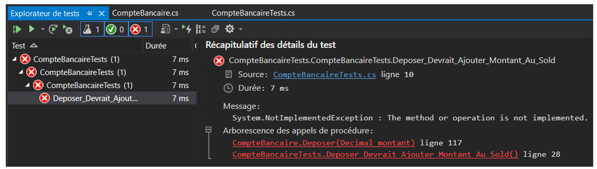
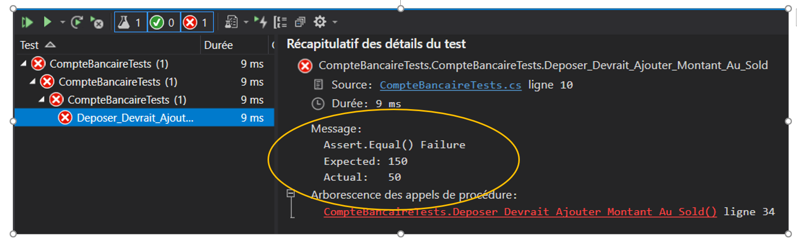
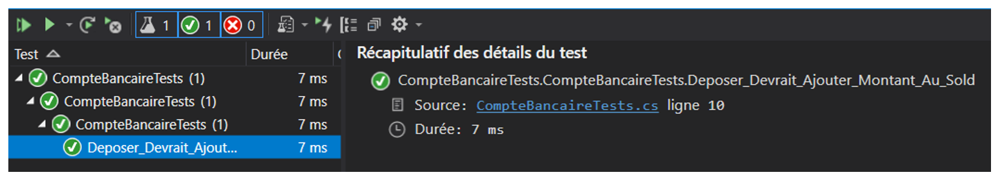
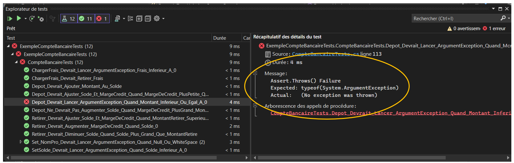
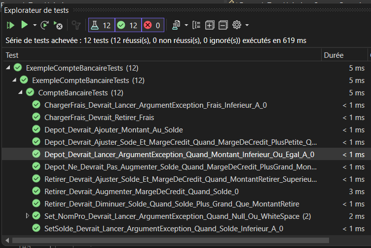
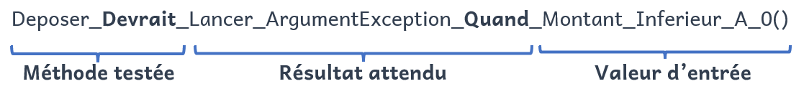
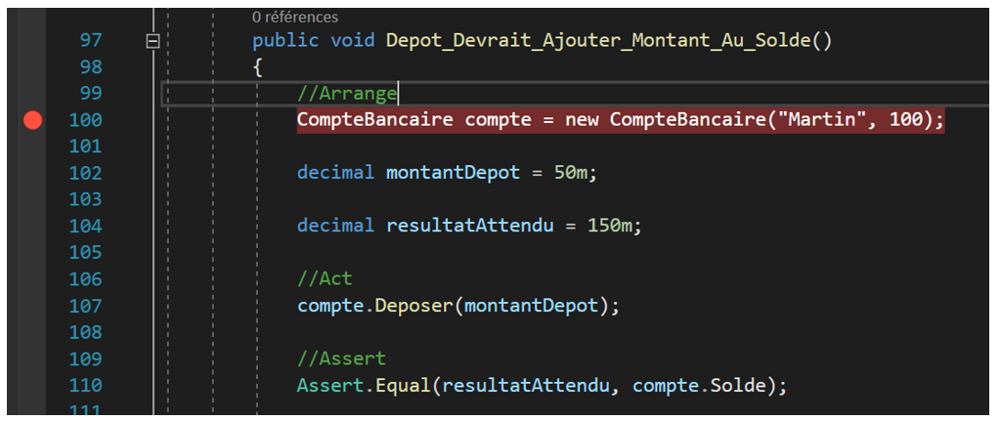
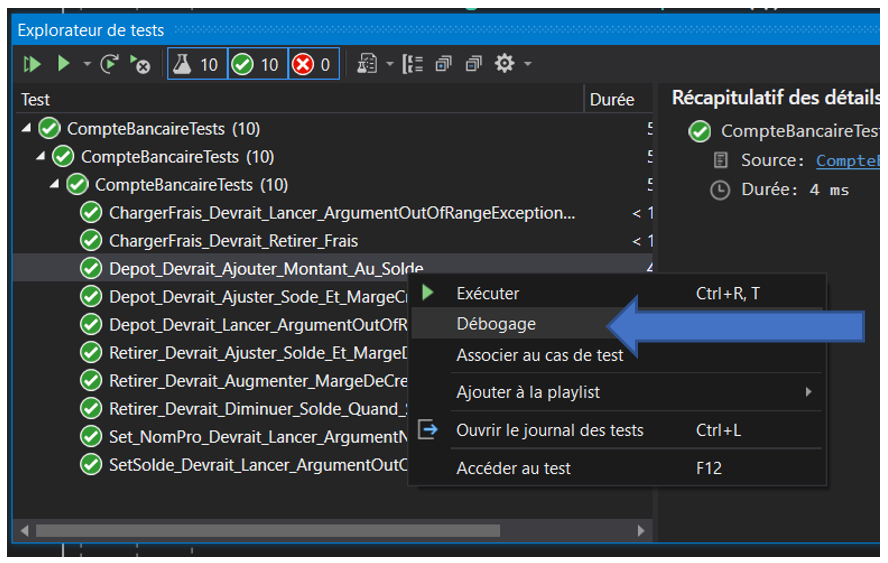

# Les tests unitaires en C#

Les tests unitaires offrent aux développeurs un moyen rapide de tester leur code afin de rechercher des erreurs de logique dans les méthodes de leurs classes. Il s'agit de code permettant de s'assurer que les méthodes des classes font exactement ce qu'elles sont censées de faire. Ceux-ci permettent donc de s'assurer de la qualité du code. 

L'objectif principal d'un test unitaire est d'isoler une partie de code pour identifier, analyser et corriger les erreurs.
Ceux-ci ont l'avantage de :

- Réduire les erreurs dans les nouvelles fonctionnalités développées ou réduire les bogues lors de la modification du code dans des fonctionnalités existantes.
- Réduire les coûts de développement, car les erreurs sont détectées rapidement.
- Améliorer la conception et permettre une meilleure refactorisation du code.
- Servir de complément pour la documentation du code et comprendre le fonctionnement des méthodes.

Il existe plusieurs techniques pour la création de tests unitaires.  Nous utiliserons ici la technique du développement piloté par les tests (TDD : Test Driven Developement). 

Celle-ci consiste à :
1) **Rédiger un cas de test** : Rédiger un cas de test automatisé en fonction des exigences.
2) **Exécutez le cas de test** : Exécuter le cas de test automatisé sur le code actuellement développé.
3) **Écrire le code pour le cas de test** : Si un cas de test échoue, écrire ou modifier le code de la méthode de la classe pour que ce cas de test fonctionne comme prévu. Selon le cas, il se peut que le test doive être modifié pour répondre à un nouveau besoin.
4) **Exécutez à nouveau le cas de test** : Exécuter à nouveau le cas de test et vérifiez si tous les cas de test développés jusqu'à présent passent les tests.
5) **Refactoriser votre code** : Il s'agit d'une étape facultative. Cependant, il est important de refactoriser votre code pour le rendre plus lisible et réutilisable.
6) **Répéter les étapes 1 à 5 pour les nouveaux cas de test **: Répéter le cycle pour les autres cas de test jusqu'à ce que tous les cas de test soient implémentés.

L'un des avantages de l'utilisation du développement piloté par les tests (TDD) est qu'il permet aux développeurs de faire de petites étapes lors de l'écriture d’un programme. 

Par exemple, supposons que vous avez ajouté du nouveau code dans votre programme que vous l’avez compilé puis testé. Il y a de fortes chances que vos tests soient interrompus par des problèmes qui existent dans le nouveau code ajouté. Avec l'aide du concept TDD il est beaucoup plus facile pour un développeur de trouver et de corriger ces problèmes si vous avez écrit deux nouvelles lignes de code que si vous aviez écrit deux mille lignes de codes. Il est généralement préférable pour les programmeurs d'ajouter quelques nouvelles lignes de code fonctionnel avant de recompiler et de réexécuter les tests.

## Créer un test unitaire

### Création d'un projet de tests unitaires.

Afin de créer des tests unitaires, nous devons ajouter à notre solution un nouveau projet de type "**Projet de test xUnit C#**". Ce type de projet permet d'écrire les tests qui seront exécutés sur le code des autres projets dans la solution. Nous devrons également ajouter dans les dépendances les projets qui contiennent les classes à tester.

Pour créer les tests associés à une classe de notre programme, nous devons créer un fichier test correspondant à la classe. Par convention, le nom du fichier sera le **nom de la classe suivi du suffixe "Tests"**. Par exemple, pour une classe nommée **MaClasse.cs** il y aura un fichier nommé **MaClasseTests.cs** dans le projet de tests unitaires.

### Composition d'un test

Prenons par exemple la classe **CompteBancaire.cs** suivante :

```c#
Public class CompteBancaire
{
    
    private const decimal LIMITE_MARGE_CREDIT = 5000;

    private String _nomProp;

    private decimal_solde;

    private decimal_margeCredit;

    
    public String NomProp
    {
        get { return _nomProp; }
        set { _nomProp = value; }
    }
    
    public decimal Solde
    {
        get { return _solde; }
        private set { _solde= value;}
    }

    
    public decimal MargeCredit
    {
        get { return _margeCredit; }
        private set { _margeCredit = value; }
    }


    public CompteBancaire(String nomProp, decimal solde = 0)
    {
        MargeCredit = 0;
        NomProp = nomProp;
        Solde = solde;
    }

    /// <summary>
    /// Permet de déposer un montant dans le compte.
    /// La marge de crédit est remboursée si elle n'est pas à zéro.
    /// </summary>
    /// <param name="montant">Montant à déposer (plus grand que zéro)</param>
    public void Deposer(decimal montant)
    {
        throw new NotImplementedException ();
    }

    /// <summary>
    /// Permet de retirer un montant dans le compte.
    /// La marge de crédit est utilisée si nécessaire et possible.
    /// </summary>
    /// <param name="montant">Montant à retirer (plus grand que zéro)</param>
    public void Retirer(decimal montant)
    {
        throw new NotImplementedException();
    }

    /// <summary>
    /// Permet de charger des frais de gestion de compte.
    /// </summary>
    /// <param name="frais">Montant des frais chargés</param>
    public void ChargerFrais(decimal frais)
    {
        throw new NotImplementedException();
    }

    
}

```
::: warning Remarque
Vous remarquerez que les méthodes de la classe n'ont pas encore été implémentées. Seule la signature des méthodes a été créé avec les commentaires spécifiant ce que la méthode devrait faire.  Cela va nous permettre de créer les tests unitaires avant d'écrire le code des méthodes. 
:::

Voici le contenu du fichier **CompteBancaireTest.cs**. Celui-ci ne contient aucun test pour l'instant. 4

```c#
using System;
using Xunit;

namespace CompteBancaireTests
{
    public class CompteBancaireTests
    {
        
    }
}

```

Le modèle **AAA** (Arrange, Act, Assert) est un moyen couramment utilisé pour écrire les tests unitaires d’une méthode testée.
- La section **Arrange** d’une méthode de test unitaire initialise les objets, définit la valeur des données passées en paramètre à la méthode testée ainsi que la valeur des résultats attendus.
- La section **Act** appelle la méthode testée avec les paramètres.
- La section **Assert** vérifie que l’action de la méthode testée se comporte comme prévu selon les résultats attendus.

Voici l'ajout d'un test permettant de tester la méthode "**Deposer**" lorsque la marge de crédit est à 0.

```c#
public class CompteBancaireTests
{
    [Fact]
    public void Deposer_Devrait_Ajouter_Montant_Au_Sold_Quand_MageCredit_Egale_0()
    {

        //Arrange
        //Création d'un objet compte bancaire
        CompteBancaire compte = new CompteBancaire("Martin",100);

        //Montan à déposer
        decimal montantDepot = 50m;

        //Résultat attendu
        decimal resultatAttendu = 150m;

        //Act
        //Appel de la méthode pour le test

        compte.Deposer(montantDepot);

        //Assert
        //Vérification du solde du compte.
        Assert.Equal(montantDepot, compte.Solde);
        
    }
}
```

Nous sommes maintenant prêts à exécuter notre test. Pour cela, vous devez aller dans le menu "**Test**" de Visual Studio et sélectionner "**Exécuter tous les tests**". L'explorateur de test s'affichera et voici le résultat :



On voit ici que le test a échoué, car la méthode "**Deposer**" lance l'exception "**NotImplementedException**" pour indiquer que le code n'a pas été implémenté. Modifions le code de la méthode afin que le test fonctionne.

```c#
public void Deposer(decimal montant)
{
    this.Solde -= montant;
}
```

Exécutons à nouveau le test pour voir le résultat :



On voit que le test a échoué à nouveau et que le résultat actuel est 50 tandis que la valeur attendue est 150. 
Corrigeons maintenant le code de la méthode :


```c#
public void Deposer(decimal montant)
{
    this.Solde += montant;
}

```

Exécutons à nouveau le test :



On voit ici que le test a réussi. Il n'y a donc pas d'erreur dans notre logique d'application. 

Il est également possible de créer des tests qui s'assurent que des erreurs sont lancées par les méthodes. Par exemple, il ne devrait pas être possible de déposer un montant négatif. Dans ce cas-ci, la méthode "Deposer"devrait lancer une exception du type "**ArgumentException**" spécifiant que le montant à déposer doit être supérieur à 0. 

Voici le test correspondant à ce cas :

```c#
[Fact]
public void Deposer_Devrait_Lancer_ArgumentException_Quand_Montant_Inferieur_A_0()
{
   //Arrange

   //Création d'un objet compte bancaire
   CompteBancaire compte = new CompteBancaire("Martin", 100);

   //Montant à déposer
   decimal montantDepot = -50m;

    //Act et Assert

    //Vérifie le lancement d'exception si montant <= 0
    Assert.Throws<ArgumentException>(() => compte.Deposer(montantDepot));

}
```

Voici le résultat de l'exécution du test :



On voit ici que le test a échoué, car le code de la méthode ne lance pas d'exception. Voici la correction du code pour la réussite du test :

```c#
public void Deposer(decimal montant)
{
    if (montant <= 0)
        throw new ArgumentException("Le montant doit être supérieur à 0.", nameof(montant));

    this.Solde += montant;
}
```



## Nomenclature d’un test

Un test unitaire ne devrait tester qu’une seule chose à la fois et son nom doit exprimer une exigence spécifique. Ainsi, le nom du test devrait contenir les informations suivantes :
- Le nom de la méthode
- Le résultat attendu
- La valeur d’entrée (testée) pour que le résultat du test soit vrai.

Par exemple :




## Quoi tester?

Vos tests unitaires devraient couvrir les éléments suivants :
- Propriétés publiques
- Constructeurs publics
- Méthodes publiques

##  Déboguer un test unitaire

Pour être en mesure d'effectuer la trace du code d'un test unitaire. Vous devez placer un point d'arrêt vis-à-vis la ligne de code à partir de laquelle vous désirez commencer la trace.



Par la suite, vous devez à partir de l'explorateur de tests, sélectionner le test à déboguer. Ensuite, vous devez cliquer avec le bouton de droite de la souris sur le test sélectionné et sélectionner l'option débogage.



Il est également possible de mettre un point d'arrêt directement dans votre code.

## Démonstration
Télécharger le fichier suivant pour la démonstration : [DemoTestsUnitaires](https://gitlab.com/420-14b-fx/contenu/-/blob/main/bloc2/cours%2018/DemoTestsUnitaires.zip?ref_type=heads)