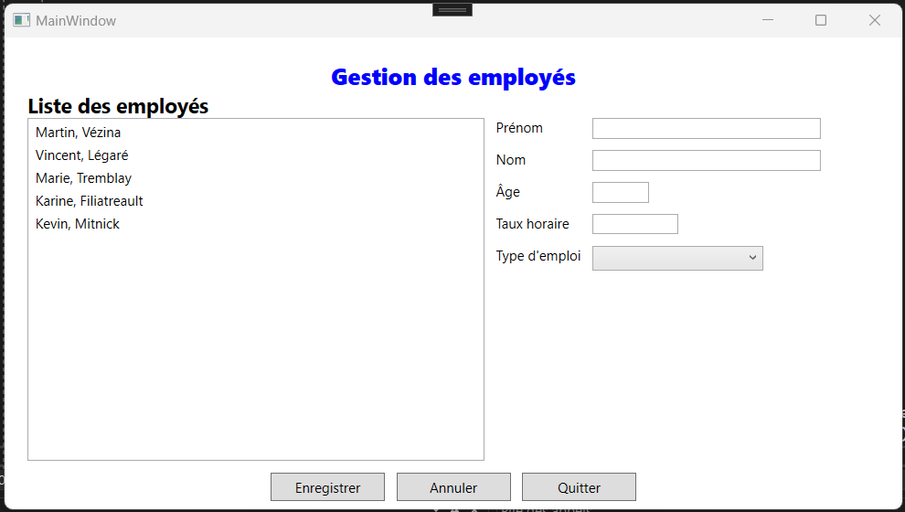
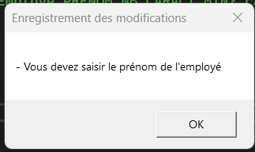
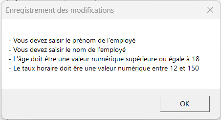

# Validation d'un formulaire WPF


La validation des données saisies par l’utilisateur dans un formulaire utilise le même principe que nous avons vu pour la valider les données dans une application console. Prenons par exemple le formulaire suivant :



Dans ce cas-ci, nous devrions nous assurer que les données saisies par l'utilisateur lors d'une modification sont :
- Obligatoires
- Du bon type
- Cohérentes

Voici comment s'assurer que le prénom est saisi :

```c#

if (string.IsNullOrWhiteSpace(txtPrenom.Text))
{
    MessageBox.Show("Vous devez saisir le prénom de l'employé.", "Enregistrement des modifications");
}

```




Lors d'une erreur, vous devriez afficher un message **suffisamment détaillé** afin que l'utilisateur puisse facilement corriger son erreur. Si vous avez plusieurs validations à effectuer sur une valeur, vous devriez vous assurer que votre message permet à l'utilisateur de corriger son erreur **sans commettre une autre erreur** de validation. Par exemple, dans le cas de la validation de l'âge, il **ne faudrait pas** faire ceci :

```c#
byte age;
if(string.IsNullOrWhiteSpace(txtAge.Text))
{
    MessageBox.Show("Vous devez saisir l'âge de l'employé.", 
"Enregistrement des modifications");
}
else if(int.TryParse(this.txtAge.Text,out age))
{
    MessageBox.Show("L'âge doit être une valeur numérique", "Enregistrement des modifications");
}
else if (age < Employe.AGE_MIN)
{
    MessageBox.Show($"L'âge doit être supérieur ou égale à {Employe.AGE_MIN}", 
"Enregistrement des modifications");
}


```

Dans ce cas-ci, l'utilisateur risque de commettre plusieurs erreurs avant de réussir à saisir la bonne information.  Nous devrions plutôt lui fournir le plus d'information pour réussir du premier coup comme ceci :

```c#
byte age;
if(!byte.TryParse(this.txtAge.Text, out age) || age < Employe.AGE_MIN))
{
    MessageBox.Show($"L'âge doit être une valeur numérique supérieure ou égale à  {Employe.AGE_MIN}", "Enregistrement des modifications");
}


```
Dans le formulaire précédent, nous devrions valider plusieurs champs avant d'accepter les modifications. Ainsi, il serait préférable de **valider tous les champs en même temps** et d'afficher un message d'erreur à l'utilisateur lui permettant de **corriger toutes ces erreurs en une seule fois**. 



Nous pourrions par exemple nous créer une méthode **ValiderEmploye()** qui valide tous les champs du formulaire et qui affiche un seul message d'erreur si un ou plusieurs champs sont invalides. Si le formulaire est valide alors la méthode retournera **True** : 

```c#
/// <summary>
/// Permet de valider les valeurs saisies dans le formulaire
/// </summary>
/// <returns>Vrai si le formulaire est valide. Faux sinon.</returns>
public bool ValiderEmployer()
{

    //Auncune erreur au départ
    string messageErreur = "";

    //Validation du prénom
    if (string.IsNullOrWhiteSpace(txtPrenom.Text))
    {
        messageErreur += "- Vous devez saisir le prénom de l'employé\n";
    }

    //Validation du nom de famille
    if (string.IsNullOrWhiteSpace(txtNom.Text))
    {
        messageErreur += "- Vous devez saisir le nom de l'employé\n";
    }

    //Validation de l'âge : numérique > 0
    byte age;
    if (!byte.TryParse(this.txtAge.Text, out age) || age < Employe.AGE_MIN)
    {
        messageErreur += $"- L'âge doit être une valeur numérique supérieure ou égale à  {Employe.AGE_MIN}\n";
    }

    //Validation du taux horaire : décimal > 0
    decimal tauxHoraire;
    if (!decimal.TryParse(this.txtTauxHoraire.Text, out tauxHoraire) || tauxHoraire < Employe.TAUX_HORAIRE_MIN || tauxHoraire > Employe.TAUX_HORAIRE_MAX)
    {
        messageErreur += $"- Le taux horaire doit êre une valeur numérique entre à { Employe.TAUX_HORAIRE_MIN} et {Employe.TAUX_HORAIRE_MAX}\n";
    }

    //Validation de la sélection d'un type d'emploi
    if (cboTypesEmplois.SelectedIndex == -1)
        messageErreur += "- Vous devez sélectionner un type d'emploi\n";


    //S'il y des erreurs on affiche le message
    if (messageErreur != "")
    {
        MessageBox.Show(messageErreur, "Enregistrement");
        return false;
    }

    //Aucune erreur
    return true;
}

```

Ainsi, il suffit d'appeler cette méthode avant la mise à jour d'un employé :

```c#
if(ValiderEmployer())
{
    // Modification des données de l'employé.
    
    // …

    // Rétroaction à l'utilisateur.
    MessageBox.Show(
        "Données enregistrées avec succès.",
        "Confirmation d'enregistrement");
}

```

## Quoi valider?

Lors de la validation des données saisies par un utilisateur, vous devriez valider les éléments suivants :
- Bon type de données
- Valeur obligatoire
- Valeur positive ou négative
- Valeur numérique minimale 
- Valeur numérique maximale
- Nombre de caractères 
- Nombre de caractères minimums
- Nombre de caractères maximums
- Format spécifique (Ex. G1A 1A1)


## Démo - validation formulaire
Télécharger les fichiers de départ de la démonstration : [DemoValidationFormulaire-Départ](https://gitlab.com/420-14b-fx/contenu/-/blob/main/bloc1/cours%2007/DemoValidationFormulaire.zip?ref_type=heads)

<!--
Télécharger démonstration commplète : [S4C1-DemoValidationFormulaire-Finale](https://gitlab.com/420-14b-fx/contenu/-/tree/main/bloc1/cours%2007?ref_type=heads)

-->


