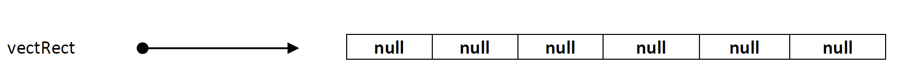
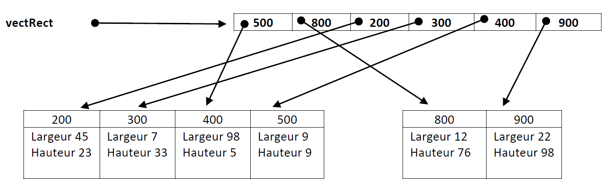

# Les vecteurs d’objets


## Affectation d'objet dans un vecteur

Lorsqu'on déclare un tableau de types primitifs, par exemple :

```c#
int[] vect = new int[5];

```

Le système alloue un espace mémoire contigu pour stocker 5 valeurs de type **int**. Lorsque vous affectez une valeur à une position dans le tableau, cette valeur est **stockée directement dans l'emplacement mémoire** correspondant :

```c#
arr[0] = 10; // Stocke la valeur 10 directement dans la mémoire à l'emplacement correspondant à arr[0].
```

Quand on parle d'objets (ou d'instances de classes), la situation est un peu différente. Reprenons l'exemple d'un tableau d'objets **Rectangle** :

```c#
Rectangle[] vectRect ;		// Déclaration du vecteur

// vectRect ne contient toujours rien mais pourra éventuellement faire référence à un vecteur.
vectRect = new Rectangle[6] ;	// Réservation de l'espace pour placer les références	 

// À noter que les objets de type Rectangle ne sont pas encore créés.

```
Ici, le système alloue de la mémoire pour 5 **références** à des objets de type **Rectangle**. Notez bien le mot "référence" : le tableau ne stocke pas directement les objets, mais plutôt des adresses (ou des pointeurs) vers ces objets.



Lorsque vous créez un nouvel objet et l'affectez à une position dans le tableau, la mémoire est allouée pour l'objet lui-même dans une autre zone de la mémoire (souvent appelée "tas" ou "heap" en anglais). **Le tableau ne contient que la référence à cet objet** :

```c#
// Allouer l'espace pour 6 rectangles et placer la référence à la position appropriée dans le vecteur
vectRect[0] = new Rectangle(9,9) ;			// adresse 500 déterminée par le SE
vectRect[1] = new Rectangle(12,76) ;		// adresse 800 déterminée par le SE
vectRect[2] = new Rectangle(45,23) ;		// adresse 200 déterminée par le SE
vectRect[3] = new Rectangle(7,33) ;			// adresse 300 déterminée par le SE
vectRect[4] = new Rectangle(98,5) ;			// adresse 400 déterminée par le SE
vectRect[5] = new Rectangle(22,98) ;		// adresse 900 déterminée par le SE

```



Cette distinction est cruciale pour comprendre de nombreux comportements en programmation, tels que le passage de paramètres par valeur ou par référence

## Passage par valeur vs par référence

### Passage par valeur

Lorsqu'un argument est passé par valeur, une copie de la valeur est créée et passée à la méthode. Dans le cas des types valeur (comme les types primitifs et les structures), cela signifie qu'une copie réelle est créée. Dans le cas des types référence (comme les classes), la référence elle-même est copiée, mais l'objet auquel elle pointe reste le même.

```c#
public static void Carre(int num) {
    num *= num;
    Console.WriteLine("Valeur dans la fonction: " + num);

    return num;
}

public static void main(String[] args) {
    int a = 5;
    int b = Carre(a);
   Console.WriteLine("Valeur après appel de la fonction: " + a);
   Console.WriteLine("Valeur de b: " + b);
}

```
Résultat :

```
Valeur dans la fonction: 25
Valeur après appel de la fonction: 5
```

Notez que la valeur de **a** n'a pas changé après l'appel à la fonction, même si sa valeur a été modifiée à l'intérieur de la fonction.

### Passage par référence

Quand un argument est passé par référence, c'est **la référence à la mémoire de cet argument qui est transmise à la fonction**. Cela signifie que toute modification de cet argument à l'intérieur de la fonction affectera aussi sa valeur à l'extérieur de la fonction.

Voyons un exemple avec l'objet Rectangle :

```c#
public static void ModifierRectangle(Rectangle rect)
{
    rect.Largeur = 20;  // Ceci modifie l'objet original
    rect.Hauteur = 40;  // Ceci modifie aussi l'objet original
    Console.WriteLine($"Dans la méthode: Largeur: {rect.Largeur}, Hauteur: {rect.Hauteur}"); 
}

public static void Main(string[] args)
{
    Rectangle rect1 = new Rectangle(5, 10)
    Console.WriteLine($"Avant la méthode: Largeur: {rect1.Largeur}, Hauteur: {rect1.Hauteur}");
    ModifierRectangle(rect1);
    Console.WriteLine($"Après la méthode: Largeur: {rect1.Largeur}, Hauteur: {rect1.Hauteur}"); 
}
```

Résultat :

```c#
Avant la méthode: Largeur: 5, Hauteur: 10
Dans la méthode: Largeur: 20, Hauteur: 40
Après la méthode: Largeur: 20, Hauteur: 40

```

Comme vous pouvez le voir, les modifications apportées à l'objet **Rectangle** à l'intérieur de la méthode **ModifierRectangle** sont bien reflétées à l'extérieur de la méthode. Ceci est dû au fait que bien que la référence à l'objet soit passée en paramètre, elle pointe toujours vers le même objet en mémoire.

Notez qu'en C# **les vecteurs sont ont aussi des objets**. Qu'il s'agisse d'un tableau de types primitifs (comme int, float, etc.) ou d'objets, le tableau lui-même est stocké comme un type référence. **Lorsque vous passez un tableau à une méthode, vous passez une référence à ce tableau**, et non une copie complète du tableau. Cela signifie que toute modification apportée au tableau à l'intérieur de la méthode se reflétera à l'extérieur de la méthode.


```c#
public static void ModifierVecteur(int[] vect)
{
    for (int i = 0; i < vect.Length; i++)
    {
        vect[i] *= 2; // double chaque élément
    }

    Console.WriteLine($"Dans la méthode: {AfficherVecteur(vect)}");

}

public static void Main(string[] args)
{
    int[] vectNombres = { 1, 2, 3, 4, 5 }; //Initialise un vecteur avec des valeurs
    Console.WriteLine($"Avant la méthode: {AFficherVecteur(vectNombres)}");
    ModifierVecteur(vectNombres);
    Console.WriteLine($"Après la méthode: {AFficherVecteur(vectNombres)}");
}

public static void AfficherVecteur(int[] vect)
{
    for (int i = 0; i < vect.Length; i++)
    {
       Console.Write($"[{vect[i]}] ");
    }
}

```

Résultat :

```c#
Avant la méthode: 1, 2, 3, 4, 5
Dans la méthode: 2, 4, 6, 8, 10
Après la méthode: 2, 4, 6, 8, 10

```

Dans cet exemple, bien que nous ayons un tableau d'entiers, qui sont des types primitifs, toute modification apportée au tableau à l'intérieur de la méthode **ModifierVecteur** affecte le tableau original dans **Main**.

La raison en est que même si les entiers eux-mêmes sont des types valeur, le tableau contenant ces entiers est un type référence. Ainsi, lorsque le tableau est passé à la méthode, c'est la référence au tableau (et non une copie complète du tableau) qui est passée.